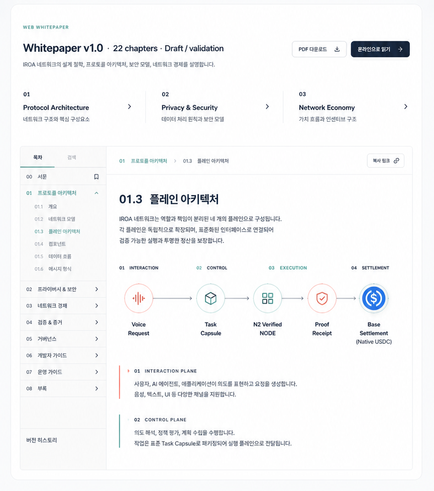
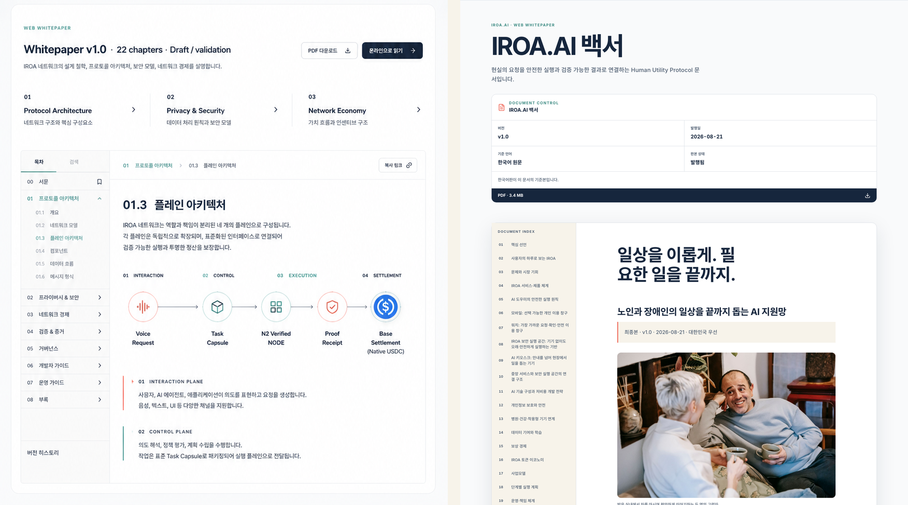
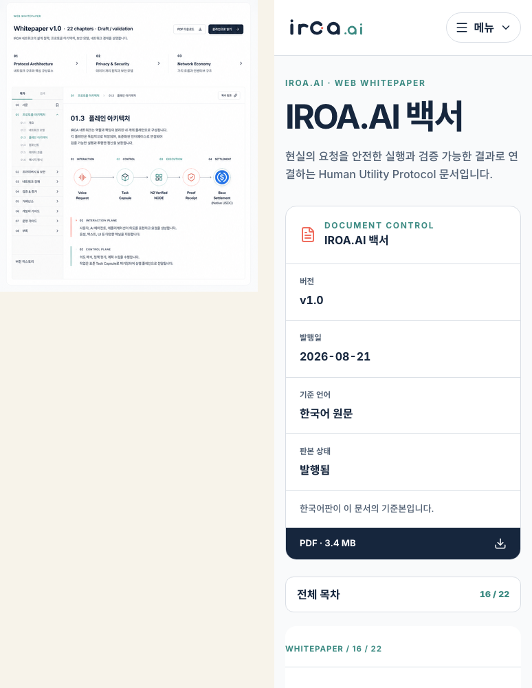

# Task 8 Web Whitepaper Design QA

This durable evidence package records the selected whitepaper reference crop and the final desktop/mobile comparison inputs used for Task 8. The three PNG files are intentionally bounded: they are enough to reproduce the fidelity judgment on a clean checkout without carrying every full-page working capture.

## Portable comparison evidence

### Selected reference crop

The selected document surface establishes the visual contract: a clear document-control block, persistent chapter index, restrained one-pixel borders, white reading plane, and Navy/Teal/Coral semantics.

### Desktop comparison

The equal-height comparison confirms that the implementation preserves the reference's technical-document hierarchy while replacing generated concept microcopy with the canonical Korean publication. The reader uses a 68ch measure, a complete sticky 22-chapter index, restrained borders, Teal location cues, and Coral document accents rather than generic blog cards.

### Mobile comparison

The source does not prescribe a mobile state. The comparison therefore checks retained hierarchy rather than pixel parity: document control remains clear, the desktop index becomes a native disclosure, content remains single-column, and navigation works without client JavaScript.

## Verification summary

- Reference crop: `864 × 976` pixels.
- Desktop comparison: `1752 × 976` pixels.
- Mobile comparison: `774 × 1000` pixels.
- Final responsive checks: `375`, `768`, `1024`, and `1440` CSS pixel widths.
- Canonical publication: Task 7 sanitized Korean master; no concept-image microcopy is treated as source.
- Assets: all 11 canonical document images load with nonzero natural width.
- Accessibility: one publication H1 and one chapter H2 per chapter; exact chapter article name; semantic navigation; stable heading self-links; unique section-derived table and scroll-region names.
- Recovery: the actual HTTP 404 retains home and whitepaper actions plus the complete 22-chapter index.
- Print: navigation controls are suppressed and A4 output was checked for clipping and overlap.
- Console/page errors: zero in the final target-width browser captures.

## Comparison history

1. The initial implementation split the Korean word `토큰` across lines at 375 px.
2. A focused DOM-range regression failed with two line boxes.
3. Applying Korean `word-break: keep-all` to the chapter H2 reduced it to one line box.
4. The final comparison inputs were regenerated after that correction and the exact article-name correction.
5. Fix Round 1 added portable evidence, contextual 404 recovery, canonical sitemap parity, and unique table names without changing the approved reader direction.

No actionable P0, P1, or P2 visual findings remain.

P3 follow-up: add an edition switch only after a canonical English translation exists.

final result: passed
