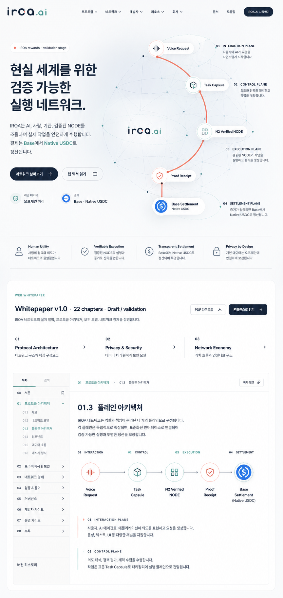
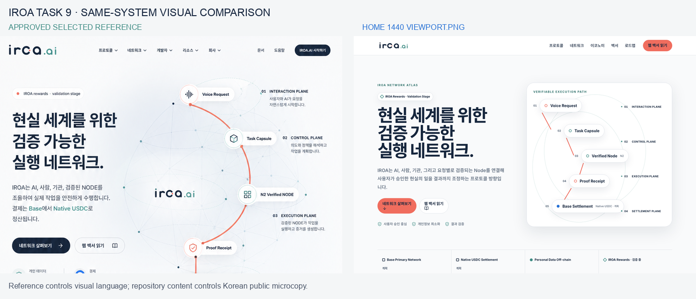
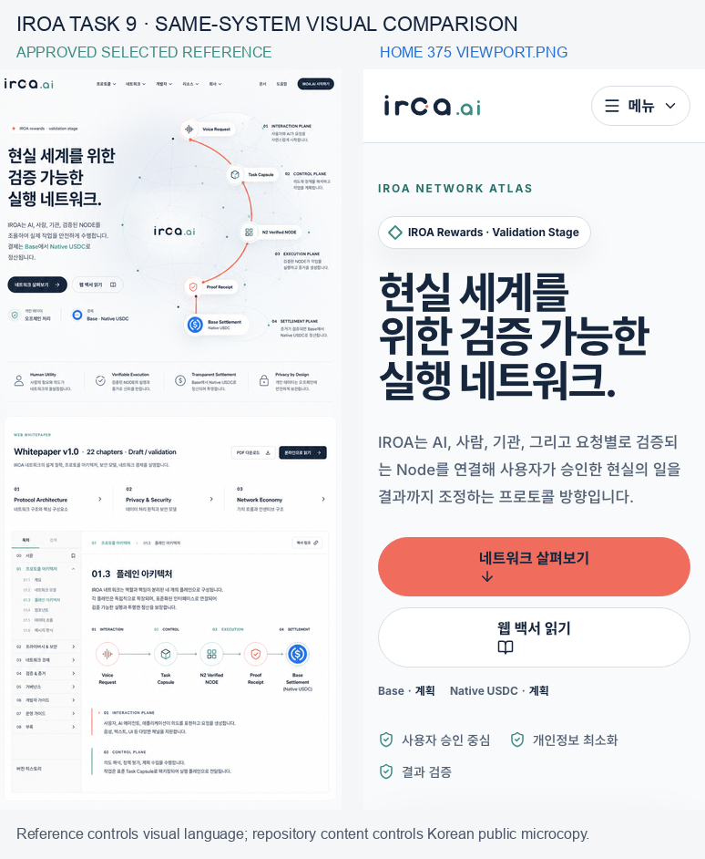
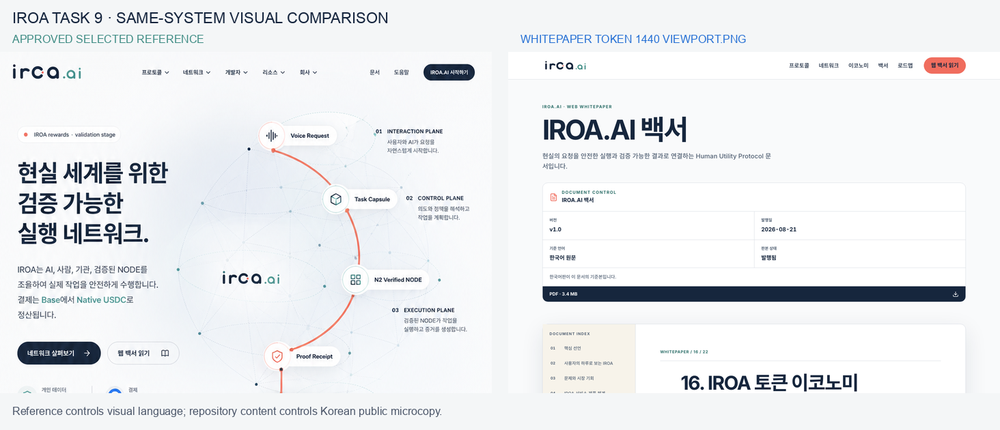
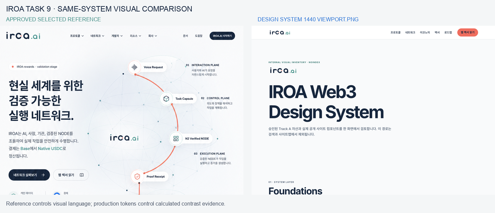
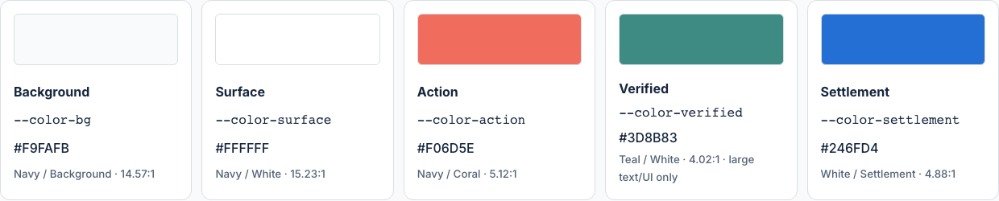

# Task 9 Final Visual QA

This bounded package preserves the exact selected Network Atlas reference and the final browser comparisons needed to review the IROA homepage, web whitepaper, and internal design-system inventory from a clean checkout. All links are repository-relative.

## Selected reference

- Dimensions: `864 × 1821` pixels.
- SHA-256: `149e13c3fcdb87a5edbf91e17dc8ee2f1013b894e728dc13523342f4627e2fb7`.
- Authority: visual language and composition. Canonical Korean repository content remains the public-copy authority.

## Homepage at 1440 CSS pixels

The final homepage retains the light Network Atlas direction: high-contrast Navy hierarchy, Teal verification cues, Coral action/path cues, a five-stage execution route, four named planes, and restrained white surfaces. The production page uses truthful status vocabulary and canonical public content instead of generated reference microcopy.

## Homepage at 375 CSS pixels

The narrow layout intentionally turns the dense desktop atlas into a readable single-column introduction with native menu disclosure, full-width actions, and the same status and safety hierarchy. The complete protocol path remains available below the first viewport; it is not hidden behind client JavaScript.

## Web whitepaper

The representative reader preserves the shared technical-document language: light surface, Navy hierarchy, Teal location cues, Coral document control, compact metadata, restrained one-pixel borders, and a persistent chapter index. The rendered chapter is the canonical Korean `16. IROA 토큰 이코노미`, not concept-image copy.

## Design-system inventory

The internal inventory carries the same wordmark clear space, Navy type hierarchy, Teal section markers, and quiet white surface. It renders production components and all supported status states rather than demo-only replicas. The route declares `noindex,nofollow` and is excluded from the sitemap.

Its color evidence now comes directly from the production semantic tokens and one WCAG sRGB calculation path: Navy/Background `14.57:1`, Navy/White `15.23:1`, Navy/Coral `5.12:1`, Teal/White `4.02:1`, and White/Settlement `4.88:1`. The production site background `#F9FAFB`, rather than BI Ivory, and the site-only Settlement Blue are reported explicitly rather than being mislabeled as BI palette combinations.

## Direct final captures

- [Homepage 1440 viewport](./images/home-1440-viewport.png)
- [Homepage 375 viewport](./images/home-375-viewport.png)
- [Token-economy reader 1440 viewport](./images/whitepaper-token-1440-viewport.png)
- [Design-system 1440 viewport](./images/design-system-1440-viewport.png)
- [Design-system 375 viewport](./images/design-system-375-viewport.png)
- [Design-system calculated color roles](./images/design-system-color-roles-1440.png)

## Browser procedure and result

- Preview: fresh static build on dedicated local port `4457`.
- Identity asserted before capture: exact homepage H1, exact whitepaper publication H1 plus chapter H2, exact design-system H1, five protocol stages, 22 inventory chapter links, and `noindex,nofollow`.
- Target captures: homepage `1440 × 1000` and `375 × 812`; token-economy `1440 × 1000`; design-system `1440 × 1000` and `375 × 812`.
- Runtime checks: HTTP 200, exact viewport dimensions, no horizontal overflow, no page errors, and HTTP 200 for ICO, SVG favicon, and Apple touch icon.
- Keyboard evidence: with JavaScript disabled, actual `Tab` movement follows the desktop chapter-index DOM order, traverses the intervening document controls, and reaches previous then next chapter. Each checked link is the active element and has a visible solid outline at least 3 CSS pixels wide.
- Favicon evidence: SVG uses `sizes="any"`; ICO declares 16/32/48 slots and each decoded RGBA frame is pixel-identical to its approved slot-specific brand PNG.
- Combined-input review: the exact selected reference and each implementation capture were inspected together.
- Result: no actionable P0, P1, or P2 visual mismatch, clipping, broken hierarchy, missing asset, or generic-template drift remains.

## Whole-branch final record

- Verified code revision: `a8774bcf4476ebe9af52d32c2370a9c84af1f38e`.
- The documentation commit containing this record is the documentation-only successor of that immutable code revision.
- Fresh final integration used the existing visual evidence plus a unique preview on port `4473`: unit `63/63`, typecheck `0` issues, build `26` pages with `22` chapters, browser E2E `47/47`, and brand/optical parity `69/69`.
- Raw HTML image regressions passed `4/4`: standalone images render as captioned figures, while paragraph, blockquote, and table-cell images retain their containing HTML structure.
- Static integrity covered `24` sitemap URLs, `11` valid built image references, a byte-identical `3,586,280`-byte PDF, `12` repository-relative portable links, and `11` valid evidence PNGs.
- The approved light Network Atlas implementation and canonical public copy are unchanged. The homepage content bundle now emits zero hashed copies of the unused legacy photographs or photo manifest, avoiding `576,406` duplicate bytes.
- Byte-identical public copies of the two photographs remain available under `/generated/docs/brand/assets/photos/` because the canonical web whitepaper consumes them. The source photo manifest is not emitted.

P3 follow-up: revisit chapter-language switching only after a canonical English publication exists.

final result: passed
