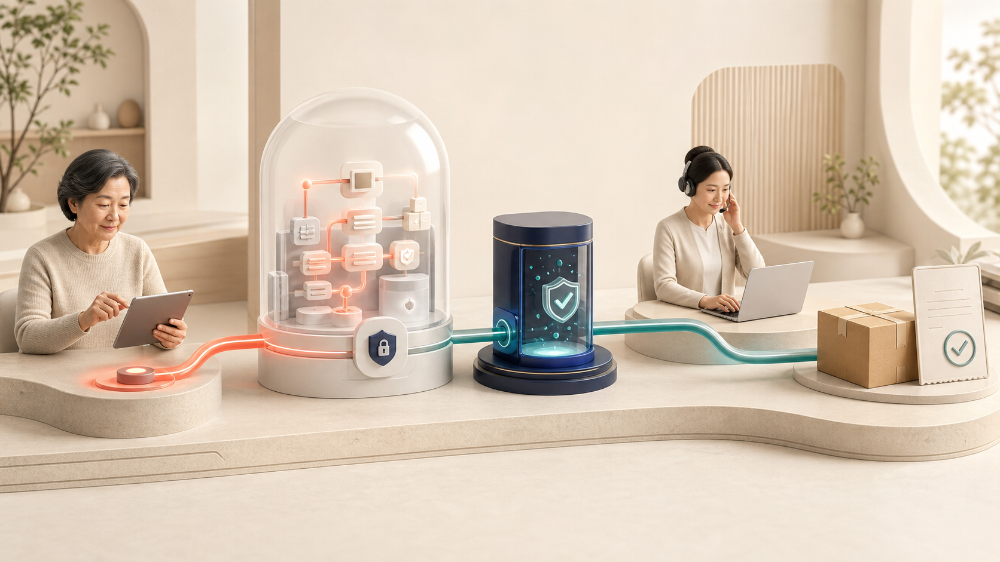
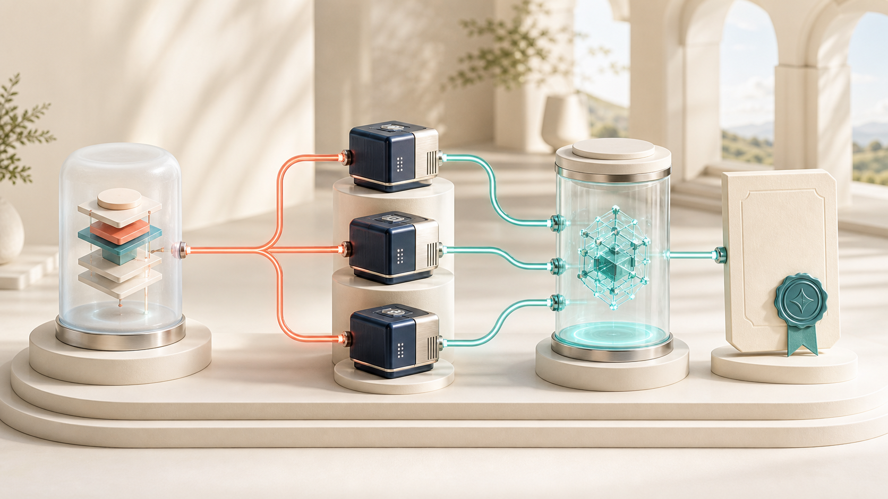
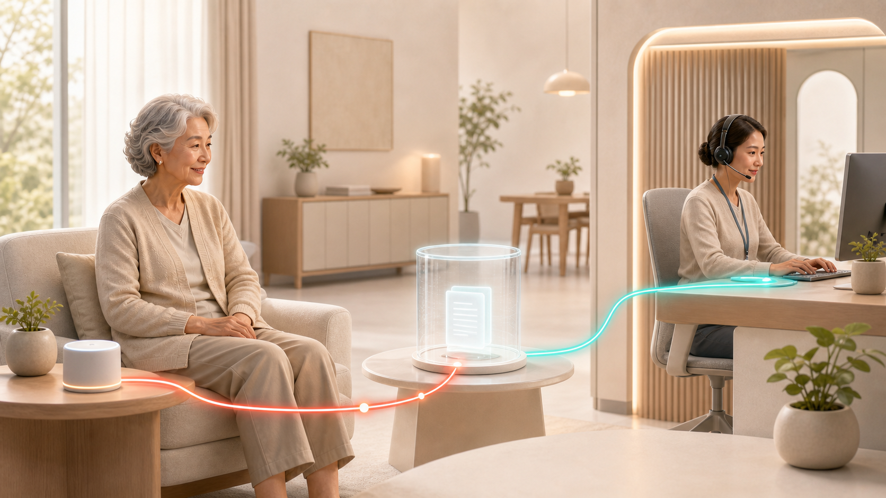
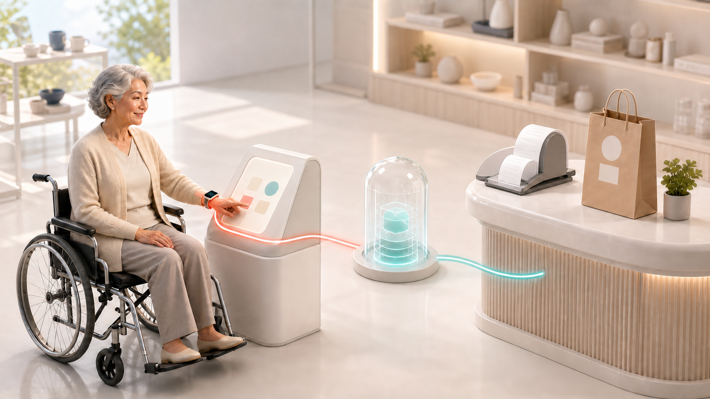
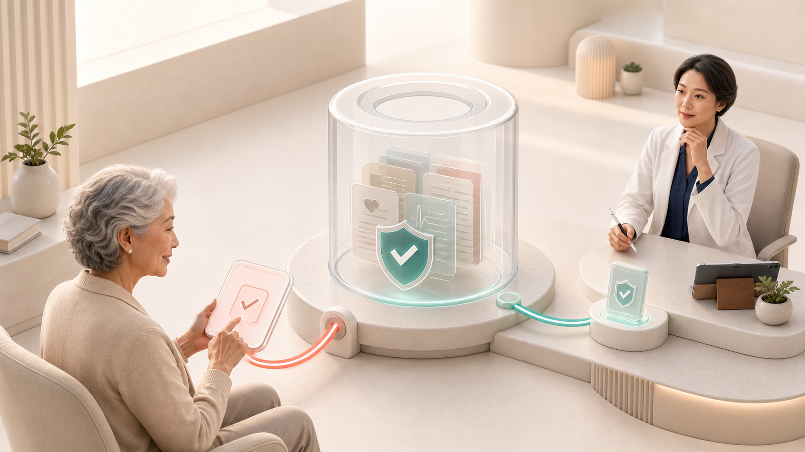
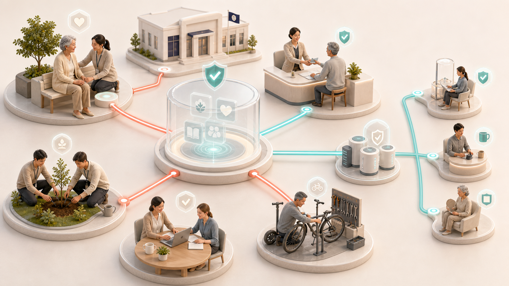
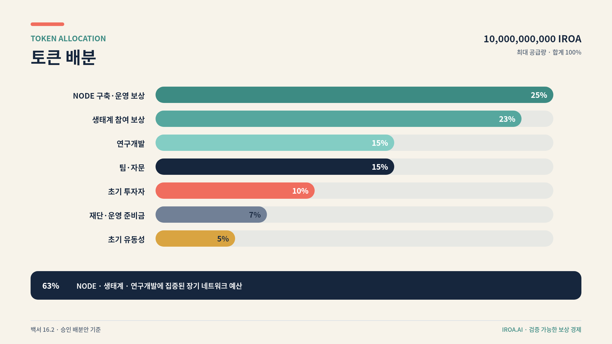
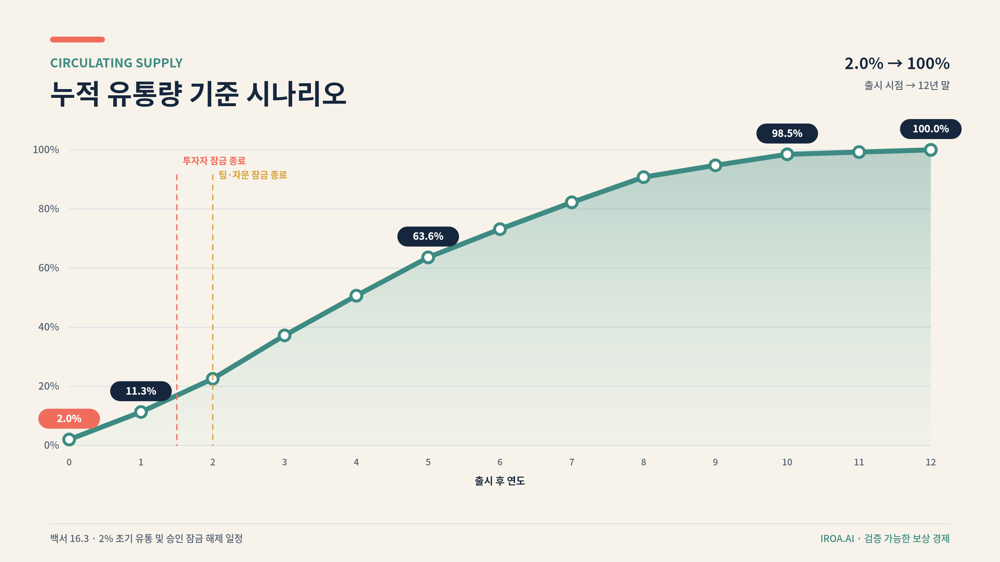
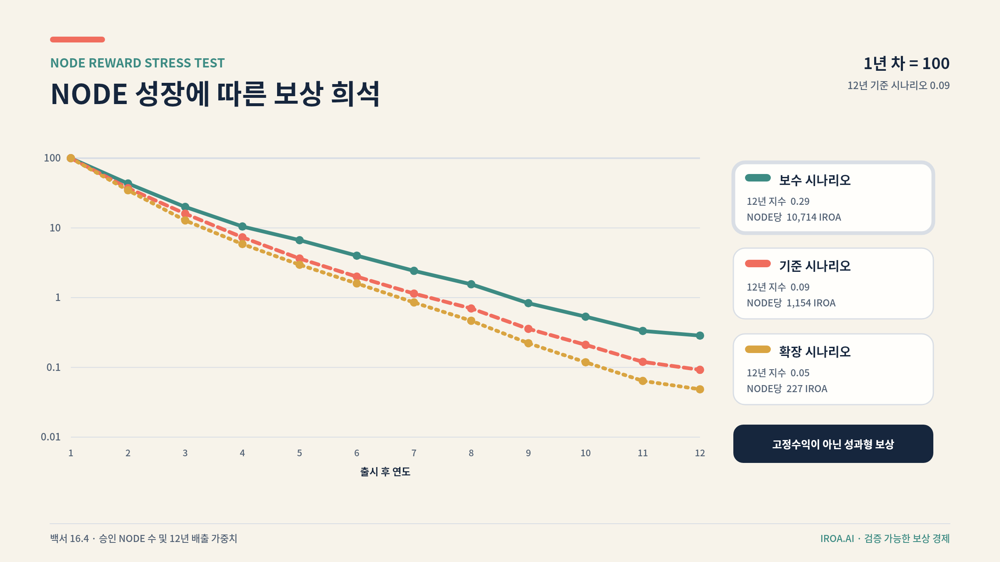

# IROA.AI Whitepaper

## Better daily life. Every essential task carried through.

### An inclusive AI support network for older adults and people with disabilities

> Final edition · v1.0 · 2026-08-21 · Republic of Korea first

IROA.AI helps older adults and people with disabilities complete everyday tasks—booking, mobility, ordering, payment, hospital visits, welfare applications, check-ins, and connection to people—without requiring them to master complex apps, websites, or kiosks. IROA stands for **Inclusive Real-world Orchestration Agent**: a network that coordinates devices and services until a real-world request reaches a confirmed outcome.

IROA does more than present information. It understands the desired result, finds suitable services, connects multiple steps, asks again at consequential moments, and requests human help when execution fails. Mobile, watch, voice call, AI kiosk, companion device, robot, hospital, and welfare systems are different access points to the same request. The user is not expected to learn every device; the user states, chooses, and approves the outcome.

Long-running, high-performance, and screen-operated work does not assume ownership of a personal computer. IROA or an approved operator provides the secure execution space. Personal data and permissions move only for the scope and time required. Verified execution-space operators and contributors may receive rewards for proven work.

The Korean edition is the controlling version. This English edition is provided for accessibility and international review. If an interpretation differs, the Korean edition governs.

---

## 1. Core Declaration

### 1.1 Mission

IROA’s mission is to ensure that skill with digital devices is never a condition for survival or independence. Regardless of age, disability, literacy, dexterity, vision, hearing, or cognitive pace, everyone should be able to express intent and use essential daily services.

IROA is not another giant all-in-one app. It is a daily-life support foundation that preserves one request state and clear responsibility boundaries even when a request begins by phone, is approved on a watch, runs for hours in a secure execution space, and finishes through a kiosk or a person.

### 1.2 Core values

1. **Completion first:** Do not stop at an explanation or search result. Produce a verifiable outcome such as a confirmed booking, accepted order, submitted application, or completed cancellation.
2. **User control:** The AI assistant does not decide on the user’s behalf. Cost, payment, contract, and sensitive-data transfer require understandable confirmation.
3. **Help by choice:** When automation is difficult or unwanted, connect naturally to family, volunteers, support workers, institution staff, or store staff.
4. **Minimum personal data:** Do not centralize a person’s entire identity. Share only what the request needs, with the required execution space, for the required time.
5. **Personalized accessibility:** Adapt dialogue, screen, confirmation method, and execution order to the person and situation—not only font size.
6. **Community participation:** Node operators, stores, institutions, volunteers, data contributors, and accessibility evaluators are co-producers entitled to fair treatment and evidence-based rewards.
7. **Relationships before technology:** Companion AI and robots do not replace people. They connect users to the relationships and help the user chooses.
8. **Device independence:** A smartphone or personal computer is not required. Phone, watch, kiosk, and companion devices provide equivalent request, approval, cancellation, and outcome channels.

### 1.3 Project boundaries

- Domain availability and trademark availability are different. Trademark, domain, and similar-service review must be completed before public expansion.
- The IROA token is intended to support Node deployment and operation and reward verified ecosystem contributions. It does not promise a fixed price, fixed return, repurchase, or listing.
- Everyday services use KRW and regulated payment methods such as cards, simple payment, and bank transfer. Essential service access never depends on token ownership.
- IROA does not replace medical diagnosis, treatment, or professional judgment.
- IROA does not promise to predict or prevent unattended death. It supports routine check-ins and faster human connection, and must validate benefits and false alarms in the field.
- Robots act only within staged safety validation. Surveillance, coercion, and uncontrolled physical action are not defaults.

### 1.4 Product promise

IROA measures whether the request was understood, whether the user knew and approved the cost and data use, whether an external service confirmed the outcome, and whether cancellation, recovery, or human handoff worked after failure. Install count, conversation count, model size, and automation rate are not the primary outcome.

**Request → Plan → Choose → Approve → Execute → Verify → Recover or hand off** is one lifecycle shared by every access point and execution space.

---

## 2. A Day with IROA

### 2.0 Say it once, continue anywhere

After saying “Book my hospital visit,” the user should not have to watch a screen. A request may start on the phone, continue with a schedule choice on a watch, run through web booking in a secure execution space, be read back by a companion device, and transfer to a welfare worker when an exception appears. Each access point receives only the data and authority needed for its current step.

| Stage | User experience | System responsibility |
|---|---|---|
| Request | Express the outcome by voice, text, touch, or switch | Reconfirm intent and constraints |
| Plan | Hear the work, expected time, and cost in plain language | Prefer official tools and classify risk and authority |
| Choose | Select among candidates or ask for a person | Do not hide or over-restrict choices |
| Approve | Separately confirm payment, submission, or sensitive transfer | Issue one-time task authority |
| Execute | Approved work can continue after the device is turned off | Manage isolation, state, and retry |
| Verify | Receive booking number, receipt, or official result | Verify the external outcome, not a screen change |
| Recover | Cancel, refund, retry, or connect to a person | Prevent duplicate action and hand off responsibly |

### 2.1 Rehabilitation hospital booking and mobility

A user says, “Book rehabilitation next Tuesday morning and arrange an accessible taxi.” IROA confirms intent, loads only approved preferences, prefers the hospital’s official integration, and otherwise uses an isolated per-request browser. It explains schedule and cost choices, submits only after final approval, coordinates transport, and reports through the user’s chosen channel. Login problems, ambiguous questions, or failed booking trigger a bounded handoff to an approved person.

### 2.2 Kiosk ordering and payment

A user with hearing and motor impairments starts a session through watch or mobile QR/NFC. The kiosk temporarily applies accessibility preferences, explains suitable options in the right combination of text, image, sign-language video, or speech, and reconfirms item, quantity, price, discount, and refund terms. Payment credentials remain in the regulated payment provider’s approval flow. Personalization data and temporary tokens are deleted when the session ends.

### 2.3 Companion and staged check-in

The companion supports conversation and routines chosen by the user. A missed response is not immediately classified as danger. IROA retries across permitted channels, waits for the user-defined interval, then sends the minimum help request to selected family, neighbors, volunteers, or institutions. Emergency services are contacted only under a predefined emergency rule or clear immediate danger. The user can stop, change, or delete signals, timing, contact order, and conversation memory.

### 2.4 Welfare applications and long-running requests

Even without a smartphone or computer, a secure execution space can check current public information and compare only consented fields. It can continue within limited authority after a call ends and report through phone, watch, companion, or an approved helper. IROA distinguishes “possibly eligible,” “application accepted,” and “benefit approved.”

### 2.5 Booking by phone without a smartphone

The voice assistant explains minimum identity checks without requesting a full resident number, password, or OTP in conversation. If candidates are not immediately available, it calls back after secure execution completes. Final submission follows a clear read-back of time, place, and cost. Text relay, sign-language interpretation, and protected human handoff provide equivalent routes.

### 2.6 When execution fails

IROA explains where it stopped, clearly marks anything already sent or paid, and offers retry, another channel, or human help. A handoff carries the necessary summary and approved context—not the entire conversation. De-identified failure evidence may improve service and Node quality.

---

## 3. Problem and Market Opportunity

### 3.1 Digital access gap

As Korea becomes a super-aged society, installation, registration, identity verification, complex menus, small targets, timeouts, and payment errors can block access to mobility, health care, food, and welfare. Different disabilities require different interaction and support; a single “large text mode” is not enough. IROA treats the gap as a service-design problem, not merely a lack of user training.

### 3.2 Limits of current accessibility solutions

Screen magnification, reading, task-specific chatbots, caregiver proxy use, wearable dashboards, staff-call buttons, and document-reading tools are valuable but fragmented. After understanding information, the user still has to cross apps, authenticate again, choose options, pay, and verify the result. IROA joins these pieces into one request execution flow.

### 3.3 Primary participants

| Participant | Primary need | IROA value |
|---|---|---|
| Older adults | Complex apps, authentication, small screens, memory burden | Conversational requests, fewer steps, repeated explanation, human help |
| People with disabilities | Input, output, and mobility constraints | Personalized accessibility and assisted execution |
| Families and caregivers | Repetitive support and unclear responsibility | Approved help scope, progress, and review records |
| Volunteers and support workers | Safe matching and recognition | Verified requests, guidance, and rewards |
| Stores | Kiosk cost, staff burden, complaints | Accessible execution and remote management |
| Hospitals and welfare institutions | Repeated calls and accessibility duty | Standards-based links, preparation, and safe handoff |
| Node operators | Productive use of equipment and space | Quality-based compensation for verified execution |
| Public institutions | Digital inclusion and care cost | Local access points and measurable social outcomes |

### 3.4 Differentiation

General assistants provide broad answers but rarely own outcome verification. Accessibility tools improve interfaces but leave cross-service procedures to the user. RPA automates screens but often lacks personal authority and sensitive-data boundaries. IROA combines user-controlled authority, official integrations, isolated execution, result verification, and chosen human help.

### 3.5 Initial market

IROA begins with a small number of high-frequency, high-friction requests in Korea: booking and changes, accessible mobility coordination, store ordering, welfare preparation, and check-ins. Expansion depends on measured completion, safety, institutional agreements, and sustainable unit economics—not addressable-market claims alone.

---

## 4. IROA Service and Product System

IROA is a product family that shares request state, identity, consent, and accessibility policy. Users choose the access point suited to the moment without losing request continuity.

| Component | User-facing role | Core responsibility |
|---|---|---|
| IROA AI Assistant | Request work and check progress conversationally | Planning, tool choice, risk, outcome verification |
| IROA Mobile | Rich personal settings, approval, and results | Local credentials, profile, biometric approval |
| IROA Watch | Nearby request, confirmation, and alert | Haptic or voice approval, daily signals, kiosk link |
| Secure Execution Space | Continue long tasks after a device turns off | Isolation, one-time authority, result and deletion receipts |
| IROA Kiosk | Complete ordering, booking, and payment on site | Adaptive flow, exception handling, staff handoff |
| IROA Companion | Conversation, routines, check-ins, and connection | User-defined memory, retry, relationship connection |
| IROA Robot | Remote presence and bounded physical help | Local safety, stop controls, staged validation |
| IROA Support Network | Link institutions, stores, helpers, and Nodes | Trust levels, quality, settlement, disputes, audit |

### 4.1 Daily-request AI assistant

The assistant converts a spoken request into a plan containing goals, constraints, services, and approval points. Supported categories may include bookings, accessible transport, ordering, store payment assistance, welfare preparation, hospital visit preparation, routines, helper calls, and cancellation or refund support.

### 4.2 Personalized accessibility assistant

Settings reflect actual preference and ability: text size and density, speech speed and repetition, touch area and switch input, captions and vibration, sign or pictorial explanation, number of choices, plain language, fatigue-aware simplification, and helper permissions. The user device is the default store; external environments receive minimum temporary settings.

### 4.3 Human-help network

People participate when a call or field judgment is needed, legal representation is required, or the user chooses not to automate. Roles and information access are granular. Identity and role are verified, and every performed request leaves a reviewable record.

### 4.4 Companion and check-in assistant

Users set when it may initiate, retry limits, avoided topics, allowed memory, and whom to contact. It supports conversation, chosen routines, scheduled human connection, staged non-response checks, immediate stop and deletion, and explicitly prohibits diagnosis or prediction of unattended death.

### 4.5 Proof of outcome

IROA distinguishes understanding, search, selection, submission attempt, service receipt, payment approval, final confirmation, and completed cancellation or refund. Where possible, it verifies official API responses, booking identifiers, payment approval, and official notifications.

### 4.6 Service catalog and responsibility

Each service card states supported country, official integration or screen execution, required identity, confirmation points, expected time and cost, cancellation, human handoff, and retention. Unsupported work is labeled **unsupported**, **under review**, or **human help available**—never disguised as a result.

---

## 5. Safe Execution Principles

### 5.1 Automate action, not judgment

| Action | Default handling |
|---|---|
| Search and summarize | May run automatically |
| Compare schedule candidates | Run, then explain |
| Build a cart | Run, confirm before payment |
| Free booking | Prior consent or final confirmation by policy |
| Paid booking, order, or payment | Present amount and terms, then confirm |
| Transfer health information | Explicit consent to recipient, purpose, and fields |
| Contract, loan, or investment | Never auto-finalize |
| Password or OTP | Only on user device or official authentication surface |

### 5.2 Prefer official connections

IROA prefers published APIs, institutional standards, MCP tools, Apple App Intents, Android AppFunctions, and other official capabilities. When screen execution is unavoidable, it uses an isolated per-request environment, allowlisted domains and actions, separate user confirmation for consequential steps, no central password or payment-key storage, independent outcome checks, and immediate stop or human handoff on failure.

### 5.3 Respect mobile-platform limits

Mobile operating systems restrict arbitrary cross-app control. IROA uses official deep links, APIs, intents, shortcuts, allowed system features, and safe web flows first, then moves the request to a secure execution space with approval. Experimental platform capabilities are not treated as launch dependencies.

### 5.4 Explain and cancel

Users can ask what is happening, why an option was selected, which data goes to whom, whether cost occurs, whether the action can stop or reverse, and whether a person can check it. Explanations use plain language appropriate to the user.

---

## 6. Mobile: An Optional Personal Access Point

Mobile provides the richest settings and approval experience but is not mandatory. Identity and consent belong to the user, not a device, and each access point temporarily uses only needed authority.

### 6.1 Core functions

- Voice, text, photo, and button requests
- Local schedule, preference, and accessibility profile
- Biometric approval for consequential action
- Service-account and permission management
- One-time authority for secure execution spaces and kiosks
- Progress, result, payment, and helper controls
- Data access, deletion, and consent withdrawal

### 6.2 Work mobile cannot safely complete

Long forms, multi-window bookings, desktop-only systems, hours-long waiting, and large document or model workloads can move to an IROA secure execution space. The approval channel creates a bounded authority containing purpose, sites, expiry, usable information, and forbidden actions.

### 6.3 Users without mobile

Options include registered phone and voice verification, in-person institutional verification when required, passkeys or one-time QR/cards on watch, kiosk, or companion, spoken request summaries, dual confirmation for payment or contract, and outcomes by call, voice device, paper receipt, or approved helper.

### 6.4 Guardian mode

Guardian mode is not full account access. Permissions can allow schedule viewing while requiring renewed user approval for a change, or require dual confirmation for payment. Health fields are shared individually, and emergency escalation can be time-limited.

---

## 7. Watch: The Nearest Request, Approval, and Safety Point

### 7.1 Role of the watch

The watch supports short voice requests, reminders, haptic or spoken approval, kiosk personalization through QR/NFC, permitted daily health signals, helper calls, payment confirmation assistance, and lightweight check-ins. It is not merely a smaller phone.

### 7.2 Samsung Health and Galaxy Watch

With user consent, selected activity, heart-rate, and sleep information may provide daily context such as fatigue reminders or user-defined safety contacts. Wearable signals are incomplete and do not replace emergency or medical judgment. Responses follow user-defined rules and are framed as checks and contacts, not diagnoses.

### 7.3 Wearable AI direction

Personalized wearable models are a research direction, not evidence of partnership or clinical validation. Sensor signals are not used as sole grounds for medical diagnosis, automatic payment, or contract.

### 7.4 Payment and the watch

IROA links secure approval provided by existing wallets, banks, card companies, or regulated payment services. It may show items and amount for confirmation, but IROA, the kiosk, and the execution space do not retain card numbers or payment keys.

---

## 8. IROA Secure Execution Space

IROA’s default remote runtime is a resettable secure execution space provided by IROA or an approved operator—not the user’s computer. It supports users without a smartphone or PC and handles long-running or high-compute work.

### 8.1 Requests that need secure execution

Examples include institutional booking and cancellation, long waiting-list or delivery checks, multi-service comparison, long forms and accessible document conversion, robot-side planning, and approved asynchronous work while a device is disconnected.

### 8.2 Isolated workspace per request

Each task receives a fresh browser or container and encryption key, allowlisted domains, tools, actions, cost, and time, approved images and updates, remote attestation, restricted logging, and deletion of cookies, temporary files, and keys at completion. Operators cannot access raw conversation, health, or booking data.

A **Task Capsule** binds seven controls:

1. request declaration with purpose, service, success condition, and expiry;
2. one-time capability limited by domain, tool, action, and cost;
3. credential-vault link using official authentication, passkey, or short token;
4. policy sandbox controlling file, network, message, payment, and transfer;
5. mandatory user-confirmation points;
6. Result Receipt proving booking, submission, or payment outcome; and
7. Deletion Receipt proving disposal of temporary credentials, cookies, and keys.

Receipts do not publish raw personal data. Only non-identifying policy version, runtime state, or integrity proof may be retained where necessary.

### 8.3 Execution-space types and trust levels

| Level | Example | Permitted requests |
|---|---|---|
| N0 public compute | Verified de-identified compute pool | Public information and synthetic or de-identified processing |
| N1 managed execution | IROA secure space or registered operator | Low-risk isolated web tasks and long tracking |
| N2 approved access point | Kiosk, welfare center, companion | Booking, ordering, bounded identity, human connection |
| N3 institution | Hospital, municipality, welfare institution | Sensitive work within contract and qualification |
| N4 personal approval | Watch, mobile, passkey, in-person check | Credential use and final approval |

A higher level does not automatically permit more personal data. Purpose, consent, data class, and current attestation must all match.

### 8.4 Identity, passwords, and OTPs

Execution spaces do not receive full account authority, passwords, or OTPs. Passkeys, OAuth, device or institutional confirmation, and verifiable credentials disclose only the necessary qualification. Payment or legal effect requires confirmation through a separate channel. Automation stops when safe separation is impossible.

### 8.5 Personal computers are optional

A user may choose local execution for already-authenticated services or private files, but owning, installing, powering, or maintaining a PC is never a condition for IROA access. Local execution runs only an explicitly enabled request and can be disconnected at any time.

### 8.6 Companion and robot execution

Wake word, accessibility preferences, short conversation, and safety policy should remain on-device where practical. Larger reasoning receives only necessary inputs and one-time authority.

Robotics advances from fixed speakers, displays, kiosks, and telepresence; to bounded mobility trials; and only then to narrowly reviewed physical assistance after safety, insurance, ergonomics, institutional, and field validation. Default face recognition, continuous recording, coercive tracking, unauthorized door opening, object movement, and physical contact are prohibited.

### 8.7 Data in use

Encryption at rest and in transit is not enough. Sensitive work must also minimize plaintext in memory, isolate processes and operators, constrain debugging and screenshots, rotate keys, and expose deletion and incident evidence. Higher-risk technologies require independent review before production claims.

---

## 9. AI Kiosk: From Guidance to On-site Completion

### 9.1 Execution-oriented kiosk

The kiosk identifies a goal, applies temporary accessibility settings, narrows and explains options, obtains confirmation, invokes regulated payment approval, verifies the receipt or booking, and deletes the session. Staff remain available for exceptions and user choice.

### 9.2 Adaptation by disability and preference

The flow may change text density, contrast, speech rate, captions, vibration, switch input, touch target, choice count, plain-language confirmation, and time limits. It adapts to actual settings rather than inferring ability from diagnosis alone.

### 9.3 Why the kiosk can be a Node

A kiosk can serve as an N2 approved access point when identity, device state, software image, data deletion, staff handoff, and output evidence meet published requirements. It receives only per-session authority.

### 9.4 Reducing store burden

IROA may offer a lightweight software layer for existing hardware, a managed subscription including device and support, or a regional deployment shared by institutions. Store benefits and reward eligibility depend on measured accessibility, uptime, safe help, and verified requests—not installed device count.

---

## 10. Central Service and Secure Execution Architecture

### 10.1 Overall structure

The Interaction Plane captures intent and approval. The Control Plane manages request state, consent, policy, trust level, and recovery. The Execution Plane runs isolated Task Capsules through approved Nodes. The Settlement Plane may later reconcile verified B2B service outcomes. Personal data remains off-chain; public evidence is minimal.

### 10.2 Central-service responsibilities

- Request lifecycle and idempotency
- Consent, policy, trust-level, and service-catalog management
- Node discovery, eligibility, health, and routing
- Minimum evidence, dispute, and audit coordination
- Human-help matching and safe handoff
- Reward calculation and budget controls

The central service does not become a permanent warehouse of passwords, OTPs, payment keys, raw health records, or complete household observation.

### 10.3 Node responsibilities

Nodes attest their operator, device, software image, security state, allowed data class, region, and service capability; accept only matching Task Capsules; perform bounded work; return outcome and deletion receipts; and support incident containment and revocation.

### 10.4 Request assignment

Routing considers task risk, data class, required institution or region, accessibility capability, available official integration, Node trust, latency, cost, energy, and human-help availability. The cheapest Node is not automatically selected.

### 10.5 Data classes

| Class | Example | Default handling |
|---|---|---|
| D0 | Public service information | Approved public compute |
| D1 | De-identified preferences or telemetry | Minimum retention and bounded analysis |
| D2 | Booking identity and contact data | Isolated managed execution |
| D3 | Health, disability, or financial context | Contracted or institutional environment |
| D4 | Credential use or consequential approval | Personal approval point only |

### 10.6 Failure and recovery

Requests use idempotency keys, bounded retry, checkpoints, external outcome reconciliation, cancellation and refund state, and explicit handoff. A Node failure does not silently become a duplicate purchase or submission.

---

## 11. AI Technology and Low-cost Development Strategy

### 11.1 Technology layers

IROA combines speech and multimodal interaction, task planning, official tool integration, policy enforcement, isolated browser execution, outcome verification, accessibility adaptation, human handoff, and Node attestation. No single model is trusted to enforce every boundary.

### 11.2 Model selection

Models are selected by task, language, latency, device, cost, privacy, and error profile. Small local models can handle wake words and simple classification; stronger hosted or managed models may plan complex work after minimum-data filtering. Critical approval, policy, and outcome checks use independent rules and service responses.

### 11.3 External-service connections

Official APIs and standards come first, tool contracts validate input and output, and screen execution is isolated and monitored. Each integration publishes supported actions, permission requirements, failure behavior, and evidence quality.

### 11.4 Starting with limited capital

IROA begins with existing models, open standards, regulated payments, a small catalog of high-value requests, managed cloud isolation, and institution-led pilots. It does not begin by training a foundation model, replacing hospital records, manufacturing a general robot, or building an unrestricted automation platform.

### 11.5 Research and development scope

Priority research includes disability-specific interaction, plain-language generation, robust outcome verification, prompt-injection resistance, capability security, remote attestation, deletion proof, on-device companion and wearable models, robot stop policy, accessibility evaluation, and privacy-preserving learning. Research claims remain separate from deployed capability.

---

## 12. Privacy and Safety

### 12.1 Connect authority, do not collect everything

IROA stores on user devices what can remain there and shares only minimum fields temporarily for execution. More data is not treated as automatically better intelligence.

### 12.2 Privacy principles

- State purpose before requesting data.
- Default to private and minimum sharing.
- Prefer user vaults, local devices, or approved institutions for sensitive information.
- Delete task data after use and separate learning consent from service consent.
- Do not unfairly restrict service after learning-data refusal.
- Do not retain raw conversation, screen, or health data indefinitely.
- Separate personal data from reward records.
- Support access, correction, deletion, portability, and withdrawal.

### 12.3 One-time task authority

~~~text
Purpose: book rehabilitation at Hospital A
Allowed site: hospital.example
Allowed actions: view times, create booking candidates
Forbidden: payment, other departments, record download
Data: name, last digits of phone, preferred date
Expiry: 15 minutes
Final submit: separate registered approval channel required
~~~

Authority is signed, scoped, and disposed after use. Verifiable credentials should disclose only needed facts. Failed remote attestation prevents assignment of sensitive work.

### 12.4 Risks of agentic execution

External content is never treated as user instruction. IROA separates request from content, validates tool input and output, stops on privilege expansion, independently controls upload, download, and messaging, checks consequential outcomes, and quarantines anomalous Nodes.

### 12.5 Rewards and personal data

Raw health, disability, conversation, voice, video, location, identity, account, and household robot observations are never written to a blockchain or public ledger. Reward integrity uses pseudonymous qualification, outcome or dispute status, minimum calculation data, policy version, and qualification revocation state.

### 12.6 Security operations

Operations include updates, vulnerability response, device enrollment and disposal, hardware-backed keys and rotation, anomalous login, request and reward detection, breach response and notice, independent assessment, and responsibility contracts for hospital, payment, and public integrations.

---

## 13. Hospital, Health, and Wearable Integration

### 13.1 Integration stages

1. information and visit preparation;
2. booking, change, and cancellation through official routes;
3. mobility, check-in, questionnaire preparation, and helper scheduling;
4. field-level consent for personal health information; and
5. standards-based institutional integration after contract and security review.

### 13.2 MyHealthWay and KR Core

IROA may help a user understand and select information from national or institutional health-data services. Standards such as HL7 FHIR and KR Core do not themselves create access authority. Contract, legal basis, security review, consent, and clinical workflow are also required.

### 13.3 Medical boundary

IROA may assist with booking, visit preparation, plain-language explanation of user-held material, questions for clinicians, reminders, chosen daily summaries, and contact after an unusual signal. It must not independently diagnose disease, change prescriptions, decide emergencies alone, impersonate clinicians, transmit health data secretly, or expose sensitive data for insurance or employment.

### 13.4 Shared value for hospitals

Potential value includes fewer repetitive booking calls, better visit preparation, advance accessibility needs, plain-language intake, coordinated mobility and support, and teach-back assistance. Initial work begins around booking and access rather than replacing core clinical systems.

---

## 14. Data Contribution and Learning

### 14.1 Lived experience is a design resource

Older adults and people with disabilities are co-designers, not data sources. Feedback about difficult steps, understandable explanations, and assistant errors is central to accessibility quality.

### 14.2 Data that may be contributed

Examples include user-submitted preferences, success and failure stage, explanation rating, consented simulated interaction, alternative plain language, Node delay and error, handoff outcome, companion retry and false alarm, robot safety stop, and de-identified usability evidence.

### 14.3 Prohibited or tightly restricted data

IROA avoids continuous collection of complete conversation, passwords, OTPs, payment credentials, unconsented health, disability, location or face data, continuous household audio or video, unapproved companion memory, continuous robot-sensor upload for reward, clinical records for general model training, and private user-helper conversation.

### 14.4 Consent and compensation

Learning and evaluation consent is separate from core service. IROA explains content, purpose, original versus summarized form, retention, deletion, reward, and limits after withdrawal. Financial vulnerability must not be exploited to induce excessive disclosure.

### 14.5 Learning strategy

Use public accessibility data and synthetic data first; collect lived-experience data minimally and separately; prefer on-device evaluation, federated learning, and privacy-preserving statistics; measure by disability, device, and request; and evaluate comprehension, completion, and handoff—not accuracy alone. Refusing data contribution does not block essential service.

---

## 15. Reward Economy

IROA rewards contribution to safe, accessible completion—not raw compute consumption.

### 15.1 Eligible contribution

Eligible roles include managed, community, institutional, and specialist Node operators; stores providing AI kiosks; volunteers and qualified support workers; older and disabled accessibility evaluators; separately consenting data contributors; institutions and developers providing integrations; and contributors who identify and verify security or operational errors.

### 15.2 Node reward criteria

Actual service fees in KRW or other regulated payment methods are the primary funding for Node operating cost and professional services. IROA tokens supplement them as performance rewards.

~~~text
Node reward
= availability
+ verified request success
+ accessibility quality
+ appropriate human handoff
+ security attestation and deletion compliance
+ regional service contribution
- failure, duplication, and delay penalties
- security and privacy violation penalties
~~~

Evaluation includes outcome proof, latency and long-running stability, cancellation and complaint rates, correct accessibility settings, attestation and minimization, deletion receipts, energy efficiency, and handoff quality. Increasing compute or conversation time does not itself earn rewards.

### 15.3 Store and kiosk rewards

Eligible evidence may include certified availability, successful accessible orders or bookings, actual staff support, local public access, and consented quality evaluation. User, payment, and outcome evidence and anomaly detection reduce self-generated fake requests.

### 15.4 Volunteers and helpers

Not all help is assumed to be unpaid. Expenses, activity fees, local currency or points, recognized volunteer time, education and reputation, and formal professional fees may be combined according to expertise, duration, travel, responsibility, and risk. Qualified domains such as medicine, law, and finance are limited to verified professionals or institutions.

### 15.5 Reward disputes

Payment is not removed solely by an automated score. Users and operators can appeal, material penalties receive human review, evidence and policy version are disclosed, and slower work caused by disability is not misclassified as poor quality.

---

## 16. IROA Token Economy

The priority of the token economy is sustainable real-world service, not token price. The token supports Node deployment and operation, verified participation, and research and development. Node operators rely primarily on service fees in KRW or regulated payment methods; tokens are performance rewards. Users do not need tokens for booking, mobility, ordering, check-ins, or other essential functions.

### 16.1 Supply principles and token roles

- Maximum supply is fixed at **10,000,000,000 IROA**, with no additional issuance.
- Nodes earn performance rewards after verified completion and compliance with availability, security, deletion, and accessibility requirements.
- Users, helpers, evaluators, institutions, hospitals, stores, and local access points share one ecosystem-participation pool.
- Research allocation funds accessibility AI, secure execution, robot safety, privacy technology, and field validation.
- There is no promise of fixed price, fixed return, principal protection, repurchase, exchange listing, or appreciation.
- Safety, privacy, cancellation rights, and essential access cannot be limited by token holdings or voting power.

### 16.2 Token allocation

| Allocation | Share | Amount | Primary use |
|---|---:|---:|---|
| Node deployment and operation rewards | 25% | 2,500,000,000 | Equipment, verified work, availability, security, and quality |
| Ecosystem participation rewards | 23% | 2,300,000,000 | Users, helpers, evaluators, institutions, hospitals, stores, and local access points |
| Research and development | 15% | 1,500,000,000 | Accessibility AI, security, robot safety, and field research |
| Team and advisors | 15% | 1,500,000,000 | Core development and long-term operation |
| Initial investors | 10% | 1,000,000,000 | Initial product and server foundation |
| Foundation and operating reserve | 7% | 700,000,000 | Audit, legal, security incident, and contingency operations |
| Initial liquidity | 5% | 500,000,000 | Initial circulation and market infrastructure |
| **Total** | **100%** | **10,000,000,000** | |

Node, ecosystem, and R&D receive **63%**. Ecosystem participation uses one managed pool rather than many small participant-specific pools. Payment basis and use by participant category are disclosed quarterly.

### 16.3 Initial circulation and vesting

| Category | Circulation and vesting principle |
|---|---|
| Initial circulation | 2% of maximum supply |
| Remaining initial liquidity | Linear release over 36 months beginning in month 1 |
| Initial investors | 18-month lock, then linear release over 42 months |
| Team and advisors | 24-month lock, then linear release over 72 months |
| Foundation and operating reserve | 12-month lock, then linear release over 84 months |
| Node rewards | Staged emissions over 12 years |
| Ecosystem and R&D | Each deployed progressively over 10 years |

Baseline cumulative circulation is 2.0% at launch, 11.3% at year 1, 63.6% at year 5, and 98.5% at year 10. Team and investor allocations do not circulate at launch. Their maximum combined monthly unlock is spread to remain at or below 1.98% of the previous month’s cumulative circulating supply.

### 16.4 Node reward model

~~~text
Node token reward
= verified request completion
+ availability and response
+ accessibility and quality
+ security proof and deletion compliance
- failure, duplication, and delay penalties
- fake-work, security, and privacy penalties
~~~

Registering a Node or leaving equipment on does not create fixed returns. Result Receipts, cancellation and disputes, disability-specific quality, security state, and real service use are evaluated together. Fake requests and inflated Node counts can cause reward holds, suspension, and clawback.

In the 12-year stress test, the simple average token amount per Node declines sharply as the fixed pool is shared across more Nodes. In the baseline scenario, the year-12 average is approximately 1/1,083 of the year-1 average. Token emissions alone therefore cannot guarantee server, electricity, connectivity, or security-staff cost. If request fees and institutional contracts do not grow, new Node expansion slows and reward rates are recalculated.

### 16.5 Ecosystem and R&D execution

One ecosystem pool covers users, helpers, accessibility evaluators, institutions, and local access points. Rewards depend on verified completion, accessibility improvement, safe handoff, field operation, and error discovery—not personal-data volume or time spent. Qualified professional help is restricted to verified professionals or institutions.

R&D priorities are disability-specific accessibility and plain language; Node isolation, attestation, minimization, and deletion proof; recovery, duplicate prevention, and outcome verification; on-device wearable, companion, and robot safety; standards-based hospital, welfare, and public integration; independent security audit, privacy impact assessment, and co-evaluation with affected users.

### 16.6 Financial and governance controls

Team, investor, and foundation wallets, schedules, and execution records are disclosed. Foundation and R&D budgets use multisignature control, annual budgets, staged payment, and quarterly disclosure. Conflicted decision-makers recuse. Smart contracts and reward formulas receive independent security audit. Securities, virtual-asset provider, tax, accounting, user-protection, and privacy questions receive separate review before issuance or circulation. Features lacking legal, security, and accounting clearance are not deployed publicly.

### 16.7 Simulation validation results

| Validation | Criterion | Result | Decision |
|---|---:|---:|---|
| Allocation total | 100% | 100% | Pass |
| Initial circulation | 5% or less | 2.0% | Pass |
| Team and investor initial circulation | 0% | 0.0% | Pass |
| Maximum monthly team and investor unlock impact | 2% or less of prior circulation | 1.98% | Pass |
| Node reward period | 10 years or more | 12 years | Pass |
| Node, ecosystem, and R&D share | 60% or more | 63% | Pass |
| Fixed Node return | Prohibited | Service fees plus performance rewards | Pass |

This baseline validates token quantities and unlock structure. It does not predict price, return, listing, exchange rate, or Node profitability. During operation, actual request volume, service revenue, Node cost, reward concentration, sell pressure, and reserve depletion are recalculated quarterly.

---

## 17. Business Model

### 17.1 Revenue sources

Potential revenue includes institutional AI and accessibility subscriptions; hospital, welfare, and municipal implementation and operation; kiosk subscription or lease; companion operation; secure-execution request and usage fees; lawful booking or ordering partnerships; Node management, security, and quality assurance; public digital-inclusion and corporate social contribution programs; and accessibility evaluation and consulting.

IROA does not accept hidden recommendation fees. Economic interests are disclosed and user suitability comes first.

### 17.2 Stakeholder value

| Participant | Cost or burden | Expected value |
|---|---|---|
| User | Consent and some service fees | Completed tasks, independence, and time saved |
| Family | Setup and bounded help | Less repetitive proxy work and approved check-ins |
| Store | Equipment, subscription, staff participation | Fewer failures and eligible Node rewards |
| Hospital | Integration and operating adjustment | Fewer repetitive calls and better visit preparation |
| Municipality | Installation and program budget | Digital inclusion and local access points |
| Node operator | Equipment, electricity, management, security | Base, performance, and compliance compensation |
| Helper | Time and responsibility | Fees, reputation, and social value |

### 17.3 Store and institution adoption

Adoption models include a lightweight layer on an existing kiosk or PC, a managed subscription including equipment and support, a regional shared deployment, standards-based institutional integration, and a companion access point operated by a welfare institution with voice, display, telepresence, and human connection.

### 17.4 Social outcome metrics

Metrics include request completion, safe human handoff, reduction in manual steps, booking or application time, failure gaps by disability, comprehension and control, staff calls, Node cost and reward balance, privacy incidents, check-in success and connection time, false alarms and deletion requests, and robot safety stops or near misses.

---

## 18. Staged Execution Plan

Timing adjusts to funding, institutional cooperation, and regulatory review. Each phase is evidence for deciding whether to fund the next.

### Phase 1 · Months 0–3: Daily requests and initial companion

Build conversational mobile, web, and phone access; two or three simulated or public-service connections; accessibility profiles; regulated payment approval links; failure and handoff; user-configured conversation and contact order; and small co-design sessions.

**Entry criterion:** users can express the goal and verify outcomes in simulated requests.

### Phase 2 · Months 4–6: Secure execution space

Build managed isolated browsers, encrypted workspaces, one-time authority, approval across channels, passkey and attestation pilots, long-running booking checks, outcome proof, and deletion receipts.

**Entry criterion:** complete bounded booking and change requests without a personal PC, duplicate action, or residual sensitive data.

### Phase 3 · Months 7–10: AI kiosk field trial

Build a lightweight kiosk prototype, QR/NFC session, disability-specific personalization, pre-payment confirmation, staff call, automatic deletion, and trials at two to five sites.

**Entry criterion:** improve completion for accessibility users while reducing store burden.

### Phase 4 · Months 11–14: Companion, community Nodes, and rewards

Operate N0–N4 trust levels, fixed companion and telepresence trials, community and specialist Nodes, quality measurement, check-in and false-alarm measurement, KRW fees plus performance-token trials, helper matching, and disputes.

**Entry criterion:** demonstrate per-request revenue and cost without privacy violations.

### Phase 5 · Months 15–20: Institution links and mobile-robot research

Run booking and visit-preparation trials, review MyHealthWay, FHIR, and KR Core, apply field-level health consent, assess institutional privacy and security, and research bounded telepresence and mobility under safety, insurance, ergonomics, and physical-stop review.

**Entry criterion:** agree legal and technical responsibility and validate safety in a real workflow.

### Phase 6 · Month 21 and beyond: Safe robotics and service stability

Expand only after external Node-security audit, accessibility governance, token-contract and reward audit, long-term token-economy validation against real revenue and Node cost, and safety, regulatory, insurance, and field evidence for any physical assistance.

### Not prioritized initially

IROA will not initially build its own foundation model, diagnostic medical AI, full hospital-record replacement, its own stablecoin, unrestricted mobile-app control, face-recognition personalization, continuous household recording, unattended care replacing people, or physical-contact robotics before safety validation.

---

## 19. Operations and Accountability

### 19.1 User rights

Users can stop AI action, choose human help, access, correct, or delete data, refuse learning contribution, understand recommendation and reward criteria, report accessibility or discrimination, and challenge automated decisions.

### 19.2 Accessibility advisory structure

No single expert represents every disability. Governance includes people with different disabilities, older users, families and support workers, accessibility specialists, health and welfare practitioners, privacy and security specialists, stores, and Node operators. Their views inform priorities, collection, rewards, and major incident response.

### 19.3 Node governance

Operator identity and equipment are verified against public quality and security criteria, periodic recertification, restriction, reward holds, and removal. Operators have appeal and recovery paths. Regional diversity reduces concentration among a few large operators.

### 19.4 Algorithmic accountability

IROA reports performance and failure by disability, discloses recommendation fees and commercial interests, preserves high-risk policy history, does not blame users for automation failure, and performs accessibility regression review before material model change.

---

## 20. Principal Risks and Responses

| Risk | Impact | Response |
|---|---|---|
| Wrong booking or order | Cost and schedule harm | Outcome verification, final confirmation, cancellation and compensation process |
| Changed website | Execution failure | API first, change detection, isolated retry |
| Prompt injection | Leakage or wrong action | Separate content, restrict tools and authority |
| Node compromise | Privacy breach | Device authentication, isolation, short authority, remote revocation |
| Kiosk residual data | Exposure to next user | Reset, local encryption, automatic deletion |
| Voice or wearable error | Wrong judgment | Confirmation, multiple signals, no diagnosis |
| Check-in false alarm | Unnecessary report and anxiety | Staged retry, chosen contact order, measurement |
| AI replaces relationships | Deeper isolation | Prefer real contact, usage and stop controls, field evidence |
| Robot collision | Physical or property damage | Limits, physical stop, standards, insurance, staged trial |
| Household surveillance | Privacy loss | Default non-collection, local processing, channel consent, deletion |
| Excess guardian control | Loss of self-determination | Granular authority, review records, withdrawal |
| Data-reward pressure | Exploitation | Separate consent, fair reward, minimum collection |
| Reward fraud | Higher cost | Outcome proof, anomaly detection, dispute review |
| Platform policy change | Reduced mobile capability | Standards, phone, watch, kiosk, and secure-execution alternatives |
| Uneven helper quality | Safety and trust loss | Role checks, training, evaluation, qualification limits |

### 20.1 When automation must stop

Stop when intent is unclear and cost or legal effect may occur; unrequested data transfer is required; a site asks for greater authority or outside contact; results cannot be verified and duplication is possible; medical, legal, or financial judgment is required; the user expresses anxiety, confusion, or refusal; a companion lacks grounds to interpret non-response; or robot sensing, braking, or connectivity falls outside safety limits.

---

## 21. Pre-launch Validation and Next Decisions

This document sets service, technology, business, and token-economy principles. Production service, token issuance, or investment communication requires separate validation.

### 21.1 Legal and regulatory

Review privacy and sensitive data; disability discrimination and accessibility; electronic finance and payment boundaries; medical and health-data law; robot product liability, safety, insurance, and household recording; e-commerce, consumer protection, and agency; volunteer and labor compensation; and token securities status, virtual-asset provider obligations, user protection, tax, accounting, and advertising.

### 21.2 Technology

Validate actual mobile-platform permissions, site terms for screen execution, Node isolation and updates, remote attestation and deletion effectiveness, passwordless recovery, institutional API authority, wearable accuracy and battery, on-device robot latency and safe stop, and independent audits of token contracts, vesting wallets, multisignature, and reward formulas.

### 21.3 Business

Validate the three highest-frequency requests, affordable store subscription, kiosk electricity, connectivity and support cost, institutional procurement cycles, helper supply and quality cost, per-request profitability funded by KRW fees, Node cost, reward concentration, demand, quarterly sell pressure, reserve depletion, and whether companion or robot access is better leased or institution-operated.

### 21.4 Validation with affected users

Measure completion by disability, understanding of action and cost, use without guardian support, timeliness of handoff, comprehensible privacy consent, sufficiency of KRW fees and performance rewards for long-term participation, effects and false alarms of companion interaction, and request, approval, cancellation, and outcome access without a smartphone or PC.

---

## 22. Conclusion

IROA.AI is not one more screen. It is a daily-life foundation that responsibly connects a request begun by phone, mobile, watch, kiosk, companion, or robot to long-running secure execution, official hospital and welfare integration, human help, and a verified real-world outcome.

Older adults and people with disabilities are co-designers and evaluators. Store and community Node operators, families, support workers, volunteers, and institutions enable execution. IROA assigns 63% of total supply to Nodes, ecosystem participation, and R&D to support verified contribution and long-term technology while placing privacy and self-determination ahead of cost reduction or automation rate.

Success is measured by completed daily requests, not model size or investment expectation. The question is whether a user who says “book it,” “help me travel,” “talk with me today,” or “connect me to a person” reaches a safe and understandable real-world outcome regardless of personal-computer ownership. Companion and robot value lies in connecting the user to chosen relationships and help—not replacing people.

This whitepaper is not an investment solicitation or medical, legal, or tax advice. The token economy is a baseline simulation of supply and vesting, not a price or profitability guarantee. Issuance and operation proceed only within completed legal, security, accounting, and business validation.
