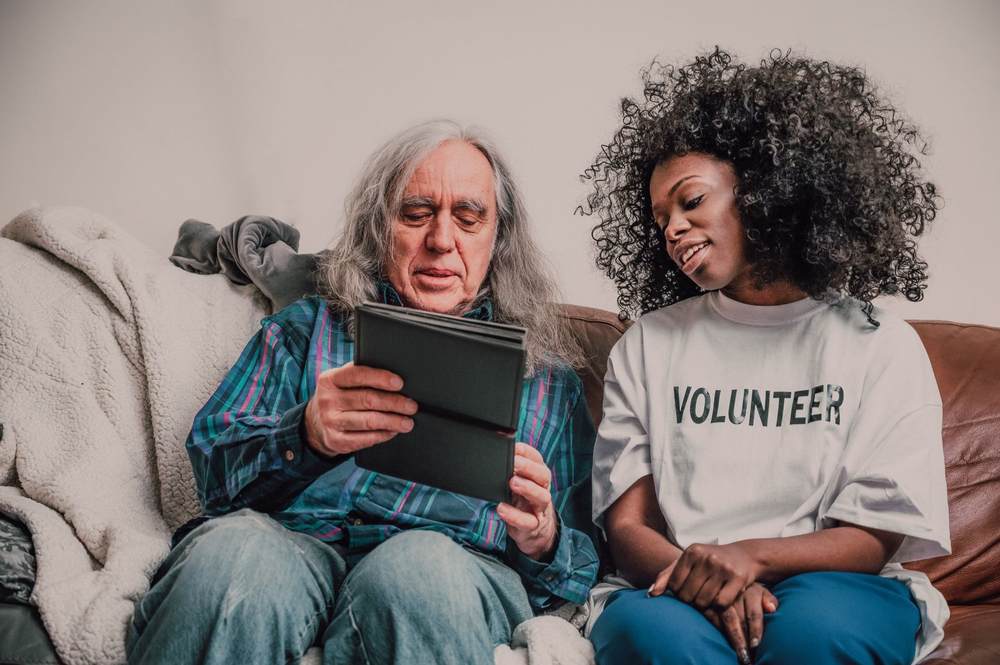
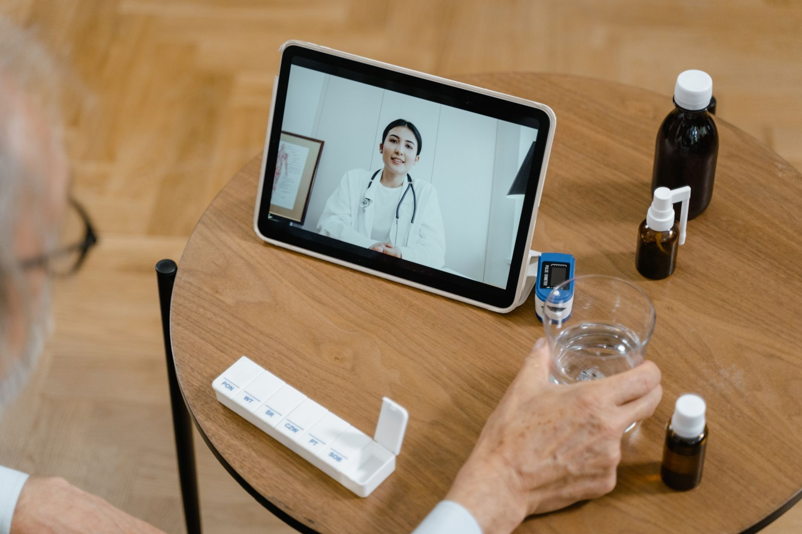
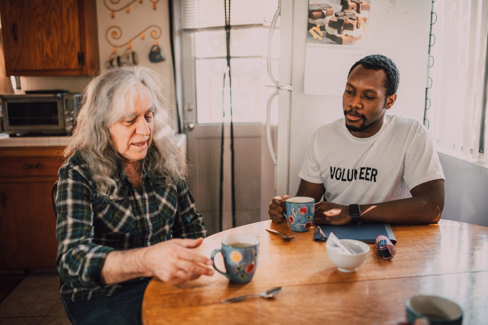

# IROA.AI 백서

## 일상을 이롭게. 필요한 일을 끝까지.

### 노인과 장애인의 일상을 끝까지 돕는 AI 지원망

> 최종본 · v1.0 · 2026-08-21 · 대한민국 우선

IROA.AI(이로아)는 노인과 장애인이 복잡한 앱·웹사이트·키오스크를 직접 조작하지 않아도 예약, 이동, 주문, 결제, 병원 이용, 복지 신청, 안부 확인과 사람 연결 같은 생활 요청을 끝까지 수행할 수 있게 돕는 **누구나 쉽게 이용할 수 있는 일상생활 AI 지원망**이다. IROA는 *Inclusive Real-world Orchestration Agent*의 머리글자이며, 여러 기기와 서비스를 연결해 실제 생활 요청을 끝까지 돕는다는 뜻이다.

IROA가 해결하려는 문제는 “정보를 보여주는 것”이 아니다. 사용자가 원하는 결과를 이해하고, 필요한 서비스를 찾고, 여러 단계를 연결하고, 중요한 순간에는 다시 확인받고, 실패하면 사람에게 도움을 요청해 **실제 결과까지 도달하게 하는 것**이다.

모바일, 워치, 음성전화, AI 키오스크, 가정용 반려기기·로봇, 병원·복지기관 시스템은 서로 다른 제품이 아니라 하나의 IROA 요청을 이어받는 이용 창구다. 사용자는 기기를 배우는 사람이 아니라 **원하는 결과를 말하고, 선택하고, 승인하는 사람**이다. 장시간·고성능·화면 조작 작업은 개인 PC 보유를 전제로 하지 않고 IROA 또는 승인된 운영자가 제공하는 보안 실행 공간이 맡는다. 개인정보와 권한은 요청에 필요한 범위와 시간만 이동하며, 검증된 실행 공간과 도움 제공자는 기여에 따라 보상받는다.

---

## 1. 핵심 선언

### 1.1 미션

IROA의 미션은 디지털 기기를 잘 다루는 능력이 생존과 자립의 조건이 되지 않게 만드는 것이다. 나이, 장애, 문해력, 손의 움직임, 시력, 청력, 인지 속도와 관계없이 누구나 자신의 의사를 표현하고 필요한 생활 서비스를 이용할 수 있어야 한다.

IROA가 제공하려는 것은 또 하나의 거대 통합 앱이 아니다. 사용자가 전화에서 시작한 요청을 워치에서 확인하고, 보안 실행 공간이 몇 시간 동안 실행한 뒤, 키오스크나 사람 도움으로 마무리하더라도 하나의 요청 상태와 책임 경계가 유지되는 **일상생활 지원 기반**이다.

### 1.2 핵심 가치

1. **완료 중심**: 설명이나 검색 결과에서 끝나지 않고 예약 확정, 이동 준비, 주문 접수, 신청 제출처럼 검증 가능한 결과를 만든다.
2. **사용자 통제**: AI 도우미는 사용자의 의사를 대신 결정하지 않는다. 비용, 결제, 계약, 민감정보 전송처럼 되돌리기 어려운 행동은 사용자가 이해할 수 있는 방식으로 확인한다.
3. **선택 가능한 도움**: 자동화가 어렵거나 사용자가 불안할 때 가족, 자원봉사자, 활동지원사, 기관 직원, 상점 직원으로 자연스럽게 연결한다.
4. **최소 개인정보**: 전체 개인정보를 한곳에 모으지 않는다. 요청에 필요한 정보만, 필요한 실행 공간에, 필요한 시간 동안 제공한다.
5. **접근성의 개인화**: 단순히 글자를 키우는 데 그치지 않는다. 사용자의 시각·청각·운동·인지 특성과 현재 상황에 맞춰 대화, 화면, 확인 방식과 실행 순서를 바꾼다.
6. **지역사회와 함께 성장**: 실행 공간 운영자, 상점주, 기관, 자원봉사자, 데이터 기여자와 접근성 평가자가 생태계의 공동 생산자이며 정당한 보상 대상이다.
7. **관계가 기술보다 먼저**: 반려 AI 도우미와 로봇은 사람을 대체하지 않는다. 외로움과 위험 신호를 혼자 처리하지 않고 사용자가 선택한 가족·이웃·자원봉사자·기관으로 연결한다.
8. **기기 비의존성**: 스마트폰이나 개인 PC가 없거나 다루기 어려워도 전화·워치·키오스크·반려기기를 통해 동일한 생활 도움을 요청할 수 있다.

### 1.3 프로젝트 경계

- `iroa.ai` 도메인 사용 가능성과 상표권 등록 가능성은 서로 다른 문제다. 공개 전 한국 및 진출 국가의 상표·도메인·유사 서비스 검토를 완료한다.
- IROA 토큰은 NODE 구축·운영과 검증된 생태계 기여를 보상하는 수단이다. 고정가격·고정수익·환매·상장을 약속하지 않는다.
- 생활 서비스의 기본 결제는 원화와 기존 카드·간편결제·계좌이체 등 규제된 결제수단을 이용하며, 핵심 서비스 이용을 토큰 보유와 연결하지 않는다.
- IROA는 의료 진단·치료를 대체하지 않으며 병원과 의료진의 판단을 침해하지 않는다.
- IROA는 고독사를 예측하거나 예방을 보장하지 않는다. 일상적 안부 확인과 빠른 사람 연결을 돕고 그 효과와 오경보를 현장에서 시험한다.
- 로봇은 단계별 안전검증을 통과한 범위에서만 움직이며, 감시·강제·무통제 신체행동을 기본값으로 두지 않는다.

### 1.4 제품 약속

IROA의 핵심 성과는 앱 설치 수, 대화 횟수, 모델 크기나 자동화율이 아니다. 사용자가 요청한 일이 정확히 이해되었는지, 비용과 개인정보 사용을 알고 승인했는지, 실제 서비스에서 결과가 확정되었는지, 실패했을 때 취소·복구·사람 인계가 가능했는지를 측정한다.

**요청 → 계획 → 선택 → 승인 → 실행 → 검증 → 복구·사람 인계**는 모든 기기와 실행 공간이 공유하는 하나의 요청 생명주기다.

---

## 2. 사용자의 하루로 보는 IROA

### 2.0 한 번 말하고, 어디서든 이어지는 하나의 요청

사용자가 “병원 예약해줘”라고 말한 뒤 계속 화면을 지켜볼 필요는 없다. 전화에서 시작한 요청을 워치에서 일정 선택으로 이어받고, IROA 보안 실행 공간이 웹 예약을 수행하며, 결과를 반려기기가 읽어주고, 예외가 생기면 복지사가 이어받을 수 있다. 각 이용 창구는 전체 개인정보가 아니라 현재 단계에 필요한 정보와 권한만 받는다.

| 단계 | 사용자 경험 | 시스템 책임 |
|---|---|---|
| 요청 | 말·글·터치·스위치로 원하는 결과 표현 | 의도와 제약을 다시 확인 |
| 계획 | 해야 할 일과 예상 시간·비용을 쉬운 말로 들음 | 공식 도구 우선, 위험·권한 분류 |
| 선택 | 후보 중 고르거나 사람 도움 요청 | 선택지를 과도하게 줄이거나 숨기지 않음 |
| 승인 | 결제·제출·민감정보 전송만 별도 확인 | 일회성 작업 권한 발급 |
| 실행 | 기기를 꺼도 허용 범위의 작업은 계속됨 | 격리 보안 실행 공간에서 상태·재시도 관리 |
| 검증 | 예약번호·접수결과·영수증을 확인 | 화면 변화가 아닌 외부 결과 검증 |
| 복구 | 취소·환불·다시 시도·사람 연결 | 중복 실행 차단과 책임 있는 인계 |

### 2.1 재활병원 예약과 이동

사용자가 워치에 말한다.

> “다음 주 화요일 오전에 재활병원을 예약하고, 휠체어 택시도 준비해줘.”

IROA는 다음과 같이 동작한다.

1. 워치가 사용자의 음성을 텍스트로 바꾸고 요청 의도를 확인한다.
2. 사용자가 허용한 개인 설정 보관소에서 선호 병원, 가능한 시간, 이동지원 조건을 불러온다. 모바일이 없어도 워치·키오스크·음성전화와 등록된 신원수단으로 진행할 수 있다.
3. 병원이 공식 연결 방식(API)이나 표준 연동을 제공하면 그 경로를 우선 사용한다.
4. 공식 연동이 없으면 IROA 보안 실행 공간이 요청별로 초기화되는 격리 브라우저에서 병원 웹사이트 예약을 보조한다.
5. 선택 가능한 일정과 예상 비용을 음성과 쉬운 문장으로 설명한다.
6. 사용자가 최종 시간을 확인하면 예약을 제출한다.
7. 이어서 휠체어 택시를 예약하고 병원 도착에 맞춘 출발 시간을 계산한다.
8. 전날 워치·전화·반려기기 중 사용자가 선택한 채널로 알리고 당일 이동 준비 상태를 확인한다.
9. 예약 실패, 로그인 문제, 복잡한 질문이 발생하면 가족 또는 승인된 도움 제공자에게 전환한다.

사용자가 직접 여러 앱을 열고 비밀번호를 찾고 날짜를 다시 입력하는 대신, 하나의 의사 표현이 여러 서비스를 연결하는 실행 계획이 된다.

### 2.2 키오스크에서 주문과 결제

청각장애가 있고 손의 움직임이 불편한 사용자가 식당 키오스크 앞에 선다. 워치 또는 모바일의 QR·NFC로 IROA 이용 연결을 시작한다.

- 키오스크는 사용자의 접근성 설정을 임시로 적용한다.
- AI 도우미가 “맵지 않은 메뉴, 알레르기 제외, 1만 원 이하” 조건을 이해해 후보를 좁힌다.
- 단순 메뉴 나열 대신 차이와 선택 결과를 쉬운 문장·그림·수어 영상·음성 중 적합한 방식으로 설명한다.
- 사용자가 “전에 먹은 것과 비슷한 메뉴”라고 말하면 사용자 기기에 보관된 선호 정보를 동의 범위 안에서 활용한다.
- 품절이나 옵션 충돌이 있으면 대안을 제시하고 필요한 경우 직원을 호출한다.
- 결제 직전 상품, 수량, 금액, 할인, 환불 조건을 다시 확인한다.
- 결제 자격증명은 키오스크나 IROA 서버가 보관하지 않고 기존 결제수단의 안전한 승인 화면에서 처리한다.
- 이용이 끝나면 키오스크에서 개인화 정보와 임시 토큰을 삭제한다.

### 2.3 반려 친구와 단계적 안부 확인

혼자 사는 고령 사용자가 아침마다 대화를 나누도록 설정한다. IROA 반려 친구는 정해진 문구를 반복하는 알람이 아니라 최근 일정과 사용자가 고른 관심사를 기억해 대화를 이어가고, 식사·수분·복약·외출 준비를 부담스럽지 않게 확인한다.

평소 응답 시간에 답이 없다고 곧바로 위험으로 판정하지 않는다. 먼저 워치·스피커·화면·전화 중 허용된 채널로 다시 묻고, 사용자가 정한 대기시간 뒤에도 응답이 없으면 지정된 가족·이웃·자원봉사자·복지기관에 최소한의 도움 요청을 보낸다. 사전에 정한 긴급 규칙 또는 명백한 즉시 위험이 있을 때만 긴급기관 연결을 시도한다. 사용자는 신호, 시간, 연락 순서, 대화기록 보관을 언제든 중지·변경·삭제할 수 있다.

이 기능의 목적은 인간관계를 AI로 대체하거나 고독사 예방을 보장하는 것이 아니다. 안부 확인 성공률, 사람과 연결되기까지 걸린 시간, 오경보, 사용자의 통제감과 외로움 변화를 측정해 실제 도움이 되는지 검증한다.

### 2.4 복지 신청과 장시간 요청

독거노인이 전화로 난방비 지원 대상인지 묻는다. 스마트폰이나 개인 PC가 없어도 IROA 보안 실행 공간이 최신 공공정보를 확인하고, 사용자의 명시적 동의를 받아 필요한 항목만 비교한다. 대기시간이 길거나 여러 기관을 확인해야 하면 사용자가 전화를 끊은 뒤에도 제한된 작업 권한 안에서 계속 작업하고 결과를 전화·워치·반려기기 또는 지정된 도움 제공자에게 알린다. 신청 가능성이 있으면 준비 서류를 설명하고 정부·지자체 공식 경로로 이동한다. 자동 제출이 허용되지 않거나 법적 확인이 필요하면 담당 기관이나 복지사와 연결한다. IROA는 “가능할 수 있다”, “신청이 접수되었다”, “지급이 승인되었다”를 구분한다.

### 2.5 스마트폰 없이 전화로 예약하기

스마트폰을 사용하지 않는 사용자가 대표번호에 전화를 걸어 “금요일 오전에 보건소 예방접종 시간을 알아봐줘”라고 말한다. 음성 AI 도우미는 통화 중 생년월일 전체나 비밀번호를 요구하지 않고, 서비스 조회에 필요한 최소 정보와 본인확인 방법을 설명한다. 후보가 즉시 나오지 않으면 통화를 끊어도 된다고 안내하고, 보안 실행 공간이 확인을 마치면 사용자가 지정한 전화번호로 발신해 후보를 읽어준다. 최종 예약은 녹음된 자동 동의가 아니라 사용자가 이해한 일정·장소·비용을 다시 말하고 승인한 뒤 제출한다. 청력·발화 장애가 있으면 문자 중계, 수어 통역, 보호된 사람 인계 등 동등한 경로를 선택한다.

### 2.6 실패했을 때

신뢰할 수 있는 AI 도우미는 실패를 숨기지 않고 다음 선택지를 제공한다.

- 어떤 단계에서 멈췄는지 설명한다.
- 이미 전송되거나 결제된 항목을 분명히 표시한다.
- 다시 시도, 다른 채널 이용, 사람 연결 중 하나를 선택하게 한다.
- 사람에게 넘길 때 전체 대화가 아니라 필요한 요약과 사용자 승인 정보만 전달한다.
- 실패 기록은 개인정보를 제거한 뒤 서비스 개선과 실행 공간 품질평가에 사용한다.

---

## 3. 문제와 시장 기회

### 3.1 고령화와 장애인의 디지털 접근 격차

대한민국은 빠르게 초고령사회로 전환되고 있다. 통계청의 「2024 고령자 통계」는 고령인구 비중의 지속적인 증가와 건강·소득·사회참여 문제를 함께 제시한다. 디지털 서비스가 일상 기반이 될수록 앱 설치, 회원가입, 본인인증, 복잡한 메뉴, 작은 버튼, 제한 시간, 결제 오류는 단순 불편을 넘어 이동·의료·식사·복지 접근을 제한한다.

국립재활원 장애인 건강보건통계는 장애인의 건강관리와 의료 이용에서 별도의 지원 필요성을 보여준다. 장애 유형에 따라 필요한 이용 방식과 도움 방법도 다르다. 시각·청각·지체·발달·뇌병변 장애를 하나의 “큰 글자 모드”로 해결할 수 없다.

한국지능정보사회진흥원은 매년 디지털정보격차 실태를 조사하며 고령층과 장애인을 별도 계층으로 다룬다. 2025년 조사도 디지털 접근뿐 아니라 AI 서비스 이용을 별도 주제로 다룬다. IROA는 이러한 격차를 “교육을 더 하면 해결되는 문제”로만 보지 않는다. 서비스 자체가 사용자의 능력과 상황에 맞춰야 한다.

사회적 고립은 디지털 사용성만의 문제가 아니다. 보건복지부의 「제1차 고독사 예방 기본계획(2023–2027)」은 위험군 발굴뿐 아니라 사회적 연결, 건강·가사 등 일상문제 지원을 함께 추진과제로 둔다. IROA는 이 정책 방향을 제품의 ‘감지’ 기능으로 좁히지 않고 대화, 생활 요청, 사람 연결이 이어지는 서비스 가설로 해석한다.

최근 소셜 로봇 연구는 고령자의 우울·외로움 완화 가능성을 보고하지만 대상과 환경에 따라 결과가 다르고 장기 근거가 제한적이다. 따라서 IROA는 효능을 전제로 로봇을 판매하지 않고, 당사자 선택권과 사람 관계를 보존하는 소규모 현장 시험부터 시작한다.

### 3.2 현재 접근성 솔루션의 한계

기존 서비스는 주로 다음 중 하나에 머문다.

- 화면 확대, 고대비, 음성 읽기와 같은 이용 창구 보조
- 특정 기관이나 특정 업무에 한정된 안내 챗봇
- 보호자에게 모든 일을 의존하는 대리 이용
- 착용형 기기 데이터를 보여주는 건강 현황판
- 키오스크 옆 직원 호출 버튼
- 문서를 촬영해 글자를 읽어주는 기능

이 기능들은 필요하지만 서로 연결되지 않는다. 사용자가 정보를 이해한 뒤에도 다른 앱으로 이동하고, 다시 로그인하고, 옵션을 선택하고, 결제하고, 결과를 확인해야 한다. IROA는 이러한 조각들을 **하나의 요청 실행 흐름**으로 연결한다.

문서·처방전·안내문을 카메라로 읽는 기능은 보조 기능으로 유지할 수 있다. 그러나 이것을 IROA의 핵심 가치로 두지 않는다. 사용자의 실생활 문제는 문자를 읽는 데서 끝나지 않고, 그 내용을 바탕으로 예약을 변경하거나 약 수령을 준비하거나 기관에 문의하는 후속 행동까지 이어지기 때문이다.

### 3.3 주요 고객과 참여자

| 구분 | 주요 필요 | IROA가 제공하는 가치 |
|---|---|---|
| 노인 | 복잡한 앱, 인증, 작은 화면, 기억 부담 | 대화형 요청, 단계 축소, 반복 설명, 사람 연결 |
| 장애인 | 장애별 입력·출력·이동 제약 | 개인화 접근성, 말·글·그림을 함께 쓰는 상호작용, 실행 대행 |
| 가족·보호자 | 반복 지원, 상태 확인, 책임 불명확 | 승인된 범위의 도움 요청, 진행상태, 점검 기록 |
| 자원봉사자·활동지원사 | 도움 요청 매칭, 기여 인정 | 검증된 도움 요청, 안전 가이드, 보상 |
| 상점주 | 키오스크 비용, 직원 부담, 민원 | AI 실행형 키오스크, 원격관리, 실행 공간 보상 |
| 병원·복지기관 | 전화·창구 반복업무, 접근성 의무 | 표준 연동, 사전 준비, 안전한 인계 |
| 지역사회 실행 공간 운영자 | 유휴 장비·공간 활용 | 검증된 실행 제공과 품질 기반 보상 |
| 공공기관·지자체 | 디지털 포용, 돌봄 비용 | 지역 접근 거점과 측정 가능한 사회성과 |

### 3.4 시장 대안 비교

| 대안 | 강점 | 남는 공백 | IROA의 차별점 |
|---|---|---|---|
| 범용 음성비서·AI 챗봇 | 자연어 질의, 광범위한 정보 | 실제 서비스 완료와 결과 책임이 제한적 | 여러 도구·실행 공간을 연결해 완료 상태를 검증 |
| 화면읽기·확대·접근성 기능 | 기기 사용성 향상 | 복잡한 절차와 앱 간 이동은 사용자 몫 | 장애 특성에 맞춰 절차 자체를 축소·대행 |
| 반복 업무 자동화(RPA)·화면 자동 조작 | 반복 화면업무 자동화 | 개인 권한·결제·민감정보 보호가 어려움 | 개인 통제 실행 공간, 일회성 권한, 사람 확인 결합 |
| 돌봄·보호자 앱 | 일정·안전·보호자 연결 | 사용자 자기결정과 다양한 생활서비스 실행 부족 | 사용자 주도 권한과 선택 가능한 사람 도움 |
| 반려 AI·소셜 로봇 | 대화, 정서적 상호작용, 루틴 지원 | 장기 효과·오경보·감시·사람관계 대체 우려 | 생활 요청 실행과 단계적 사람 연결, 사용자 중단권 결합 |
| 기존 키오스크 접근성 | 큰 글자·음성·높이 조정 | 메뉴 탐색과 예외 해결은 여전히 어려움 | 목표를 이해해 주문·예약·결제 흐름을 재구성 |
| 스마트워치 건강관리 서비스 | 가까운 알림과 일상 건강 신호 | 생활 요청 실행·기관 연결과 분리 | 워치를 요청·확인·안전 이용 창구로 연결 |
| 분산 컴퓨팅·실행 공간 보상 | 유휴 자원 활용과 참여 보상 | 취약계층 요청·접근성 성과와 무관할 수 있음 | 요청 성공·접근성 품질·사람 도움을 보상 |
| 관리형 원격 서버 자동화 | 장시간·고성능 실행과 운영 편의 | 민감정보 집중, 사용자별 책임경계 부족 | 요청별 암호화 공간·검증된 실행 공간·일회성 권한·삭제 증명 |

IROA의 경쟁력은 개별 AI 모델의 독점성이 아니라 **개인 통제, 공식 도구 연동, 격리된 화면 실행, 현장 키오스크, 사람 도움, 결과 검증을 하나의 정책 아래 결합하는 운영체계**에 있다.

### 3.5 초기 진입시장

전체 노인·장애인 시장을 한 번에 대상으로 하지 않는다. 초기에는 결과가 분명하고 반복 수요가 있으며 의료 판단을 직접 요구하지 않는 요청을 고른다.

1. **복지관·장애인 단체의 예약·이동 지원**
   사용자 모집과 사람 인계가 가능하고, 실제 어려움을 짧은 주기로 검증할 수 있다.

2. **소규모 매장의 AI 실행형 주문 키오스크**
   주문 완료율, 직원 호출, 소요시간과 상점주 비용을 현장에서 측정할 수 있다.

3. **병원의 예약·방문 준비**
   진료행위와 분리하면서도 전화·안내 부담과 사용자의 이동 실패를 줄일 수 있다.

4. **IROA 보안 실행 공간을 이용한 생활 웹 요청**
   스마트폰·개인 PC가 없는 사용자도 예약·변경·취소를 요청할 수 있고, 장시간 작업과 격리 실행의 보안 경계를 검증할 수 있다.

5. **독거노인 반려 친구 현장 시험**
   복지관·지자체와 함께 대화·루틴·사람 연결을 작은 규모로 검증한다. 고독사 예방이나 의료효과를 성과로 선결하지 않고 안부 확인, 오경보, 사람 연결, 당사자 만족을 측정한다.

초기 구매자는 개인보다 지자체, 복지기관, 병원, 프랜차이즈, 기업 사회공헌 사업이 될 가능성이 높다. 개인 이용료만으로 취약계층 서비스와 현장 지원 비용을 충당하려 하면 접근성을 낮출 수 있기 때문이다. 소비자용 기본 기능, 기관 계약, 상점 구독, 공공지원과 실행 공간 보상을 혼합해 지속 가능한 서비스 1건당 수익성과 비용 구조를 찾는다.

---

## 4. IROA 서비스·제품 체계

IROA는 한 가지 앱이 아니라 같은 요청 상태·신원·동의·접근성 정책을 공유하는 제품군이다. 사용자는 상황에 맞는 이용 창구을 선택하고 요청은 중간에 끊기지 않는다.

| 구성 | 사용자에게 보이는 역할 | 핵심 책임 |
|---|---|---|
| **IROA AI 도우미** | 말로 원하는 일을 요청하고 진행상태를 확인 | 계획, 도구 선택, 위험 판단, 결과 검증 |
| **IROA Mobile** | 가장 풍부한 개인 설정·승인·결과 화면 | 로컬 자격증명, 접근성 프로필, 생체 승인 |
| **IROA Watch** | 가장 가까운 짧은 요청·확인·알림 | 진동·음성 승인, 일상 건강 신호, 현장 이용 연결 |
| **IROA 보안 실행 공간** | 기기를 꺼도 장시간 요청을 계속하는 실행환경 | 격리 실행, 일회성 권한, 결과·삭제 확인서 |
| **IROA Kiosk** | 현장에서 목표를 이해하고 주문·예약·결제를 완수 | 자동 화면 재구성, 예외 해결, 직원 인계 |
| **IROA Companion** | 대화·루틴·안부 확인과 사람 연결 | 사용자가 정한 기억, 재확인, 관계 연결 |
| **IROA Robot** | 원격 현존과 제한된 물리적 도움으로 확장 | 로컬 안전, 중단, 단계별 검증 |
| **IROA 지원망** | 기관·상점·도움 제공자·보안 실행 공간을 연결 | 신뢰 수준, 품질, 정산, 분쟁, 감사 |

### 4.1 생활 요청 AI 도우미

생활 요청 AI 도우미는 사용자가 말한 부탁을 실행 가능한 요청으로 정리한다. 단순 질의응답이 아니라 목표, 제약, 필요한 서비스, 사용자 확인 지점을 포함한 실행 계획을 만든다.

- 병원·검진·상담·미용·공공시설 예약
- 장애인콜택시·대중교통·보호자 이동 연계
- 식품·생활용품·약국 수령 주문
- 매장·키오스크 주문과 결제 보조
- 복지제도 탐색, 서류 준비, 신청 진행
- 병원 방문 전 준비사항 확인과 방문 후 안내
- 일정·복약·운동·수면·안전 알림
- 가족·활동지원사·자원봉사자·직원 호출
- 예약 변경, 취소, 환불과 문제 해결

### 4.2 사용자 맞춤 접근성 AI 도우미

접근성 AI 도우미는 진단명만으로 사용자를 분류하지 않는다. 실제 선호와 수행 능력을 사용자와 함께 설정하고 계속 조정한다.

- 글자 크기, 대비, 줄 간격, 화면 복잡도
- 음성 속도, 반복 횟수, 말투, 언어
- 터치 영역, 길게 누르기, 스위치 입력
- 자막, 진동, 시각 알림, 수어·그림 설명
- 한 화면의 선택지 수와 확인 단계
- 쉬운 문장과 단계별 설명
- 사용자가 피로하거나 긴장했을 때의 단순화
- 도움 요청을 받을 가족·기관과 허용 범위

개인화 설정은 사용자 기기를 기본 저장소로 하고, 키오스크나 외부 실행 공간에는 이용 중 필요한 최소 설정만 전달한다.

### 4.3 사람 도움 네트워크

AI 도우미가 모든 상황을 자동화하려고 해서는 안 된다. 전화 통화가 필요하거나 현장 판단이 필요한 경우, 법적 대리 권한이 필요한 경우, 사용자가 자동화를 원하지 않는 경우에는 사람이 참여한다.

도움 제공자는 가족·법정대리인, 활동지원사·요양보호사, 기관 직원·의료사회복지사, 등록 자원봉사자, 상점 직원, 지역사회 접근성 지원 인력으로 구분한다. 사용자는 도움 제공자별로 볼 수 있는 정보와 할 수 있는 행동을 정한다. 도움 제공자는 본인확인과 역할 검증을 거치고 수행한 요청은 점검 기록과 평가에 남는다.

### 4.4 반려 친구·안부 확인 AI 도우미

반려 친구는 사용자가 요청한 관계의 방식으로 작동한다. 먼저 말을 걸 수 있는 시간, 반복 횟수, 피하고 싶은 주제, 기억해도 되는 정보, 연결할 사람을 사용자가 정한다.

- 일상 대화와 관심사 기반 활동 제안
- 식사·수분·복약·외출·예약 같은 설정 루틴 확인
- 가족·이웃·자원봉사자와 통화·방문 일정 만들기
- 장시간 무응답 시 허용 채널 재확인과 단계적 사람 연결
- 사용자가 원할 때 즉시 대화 중지·기록 삭제·사람에게 전환
- 외로움·우울·응급상황의 진단 또는 고독사 예측 금지

### 4.5 결과 증명

IROA는 요청 이해, 후보 검색, 사용자 선택, 제출 시도, 서비스 접수, 결제 승인, 예약·신청 최종 확정, 취소·환불 완료를 구분한다. 화면이 바뀌었다는 이유만으로 성공으로 간주하지 않는다. 가능한 경우 서비스 API 응답, 예약번호, 결제 승인 결과, 공식 알림 등으로 결과를 검증한다.

### 4.6 서비스 안내 목록와 책임 범위

각 생활 요청은 “AI 도우미가 무엇이든 알아서 한다”는 한 문장으로 제공하지 않는다. 예약·주문·결제·복지·병원 준비마다 지원 국가, 공식 연동 또는 화면 실행 여부, 필요한 신원, 사용자 확인 지점, 예상 시간·비용, 취소 가능성, 사람 인계 경로, 데이터 보존기간을 서비스 카드로 공개한다. 지원하지 못하는 서비스는 검색 결과로 위장하지 않고 **미지원·확인 중·사람 도움 가능**으로 구분한다.

---

## 5. AI 도우미의 안전한 실행 원칙

### 5.1 자동으로 움직이되 마음대로 결정하지 않는다

| 행동 | 기본 방식 |
|---|---|
| 정보 검색·정리 | 자동 수행 가능 |
| 일정 후보 비교 | 자동 수행 후 설명 |
| 장바구니 구성 | 자동 수행, 결제 전 확인 |
| 무료 예약 | 조건에 따라 사전 동의 또는 최종 확인 |
| 유료 예약·주문·결제 | 금액과 조건을 제시하고 최종 확인 |
| 건강정보 전송 | 수신자·목적·항목을 제시하고 명시적 동의 |
| 계약·대출·투자 | 자동 확정 금지, 별도 보호 절차 |
| 비밀번호·OTP 입력 | 사용자 기기 또는 공식 인증 화면에서만 |

### 5.2 공식 연결을 먼저 사용하고, 화면 자동 조작은 제한한다

IROA는 서비스 제공자가 공개한 API, 병원·공공기관 표준 연동, Model Context Protocol(MCP) 도구, Apple의 App Intents, Android AppFunctions와 같은 공식 기능 노출 방식을 우선한다. 공식 연동이 없는 서비스는 격리된 화면 자동 조작 실행환경에서 화면을 조작할 수 있다.

- 개인 브라우저 전체가 아니라 요청별 분리된 이용 공간 사용
- 허용한 도메인과 행동만 실행
- 웹페이지의 지시를 신뢰하지 않고 사용자 요청과 분리
- 결제·계약·민감정보 전송 전에 사용자 확인
- 비밀번호·OTP·결제키를 중앙 실행 공간에 저장하지 않음
- 화면 변화와 결과 증명을 함께 검사
- 실패 시 즉시 중단하고 사람에게 전환

OpenAI의 공식 화면 자동 조작 가이드도 격리된 브라우저·가상환경과 고위험 행동의 사람 개입을 권고한다. IROA는 이러한 원칙을 제품의 기본 보안 경계로 사용한다.

### 5.3 플랫폼 현실을 반영한 모바일 전략

모바일에서 AI 도우미가 다른 앱을 임의로 조작하는 것은 운영체제 보안정책 때문에 제한된다. 따라서 앱 바로가기 연결·공식 API, Apple의 App Intents·Siri·Shortcuts, Android AppFunctions 및 허용된 시스템 기능, 안전한 웹 흐름을 우선 사용한다. 그래도 불가능하면 사용자 승인 후 IROA 보안 실행 공간으로 요청을 이전한다. 사용자가 원하고 로컬 자료가 필요한 경우에만 개인 PC를 선택할 수 있다.

Android AppFunctions는 Android 16 이상을 대상으로 하는 실험적 시험판이며 모든 앱이 즉시 지원하는 기능이 아니다. IROA 초기 서비스의 필수 전제로 삼지 않고 지원 범위가 넓어질 때 공식 연동 계층으로 추가한다.

### 5.4 설명 가능성과 취소 가능성

사용자는 지금 무엇을 하는지, 왜 해당 옵션을 선택했는지, 어떤 개인정보가 누구에게 전달되는지, 비용이 발생하는지, 멈추거나 되돌릴 수 있는지, 사람이 대신 확인할 수 있는지를 물을 수 있어야 한다. AI 도우미는 사용자가 결정에 필요한 근거와 실행 결과를 쉬운 말로 제공한다.

---

## 6. 모바일: 선택 가능한 개인 이용 창구

모바일은 IROA를 이용하는 가장 풍부한 개인 이용 창구이지만 필수 조건은 아니다. 스마트폰을 쓰지 않거나 오래 다루기 어려운 사용자는 워치, 음성전화, 키오스크, 반려기기·로봇, 기관 직원의 지원을 통해 요청·동의·결과 확인을 할 수 있다. 신원과 동의는 특정 기기가 아니라 사용자에게 귀속되고, 각 이용 창구는 필요한 권한만 잠시 사용한다.

### 6.1 핵심 기능

- 음성·텍스트·사진·버튼을 통한 요청
- 개인 일정, 선호, 접근성 프로필의 로컬 보관
- 생체인증을 이용한 중요 행동 승인
- 서비스 계정 연결과 권한 관리
- IROA 보안 실행 공간·키오스크에 일회성 작업 권한 발급
- 실행 진행상태와 결과 확인
- 결제 전 최종 확인
- 도움 제공자 지정과 긴급 호출
- 개인정보 열람·삭제·동의 철회

### 6.2 모바일이 직접 실행하기 어려운 경우

긴 웹 양식, 여러 창을 오가는 예약, 데스크톱에서만 가능한 기관 시스템, 몇 시간 이상 기다려야 하는 작업, 큰 모델과 문서 처리가 필요한 요청은 모바일만으로 처리하기 어렵다. 사용자는 새 기기를 배우거나 개인 PC를 켜두지 않고 “안전한 IROA 실행 공간에서 계속해줘”라고 요청할 수 있다.

모바일 또는 다른 승인 창구는 요청 목적, 허용 사이트, 유효시간, 사용 가능한 정보와 금지 행동이 들어 있는 제한된 작업 권한을 만든다. 실행 공간은 그 범위를 넘어서는 행동을 할 수 없다.

### 6.3 모바일이 없는 사용자

- 등록된 전화번호와 음성 본인확인, 필요 시 기관의 대면 확인
- 워치·키오스크·반려기기의 패스키 또는 일회성 QR·카드
- 사용자에게 읽어주는 요청 요약과 음성 확인
- 결제·계약처럼 중요한 행동은 별도 안전 채널 또는 승인된 사람의 이중 확인
- 결과를 자동전화, 음성기기, 종이 영수증, 지정된 도움 제공자 중 선택해 수신

### 6.4 보호자 모드

보호자 모드는 사용자 계정의 전체 접근권한이 아니다. 일정 확인만 허용하거나, 예약 변경은 사용자 재확인을 요구하거나, 결제는 보호자와 사용자의 이중 확인을 요구하도록 세분화한다. 건강정보는 항목별로 공유하고 긴급 상황에서만 확대되는 한시적 권한을 둘 수 있다.

---

## 7. 워치: 가장 가까운 요청·확인·안전 이용 창구

워치는 작은 스마트폰이 아니라 사용자가 가장 빠르게 AI 도우미를 부르고 중요한 결정을 확인하는 동반 실행 공간이다.

### 7.1 워치의 역할

- 짧은 음성 요청과 반복 알림
- 예약·이동·복약 일정 확인
- 진동·음성·큰 선택지로 승인 또는 거절
- QR·NFC를 이용한 키오스크 개인 맞춤 이용 시작
- 낙상·심박·활동·수면 등 허용된 일상 건강 신호 활용
- 길을 잃거나 불안할 때 가족·지원인 호출
- 모바일을 꺼내기 어려운 상황의 결제 확인 보조
- 사용자가 설정한 안부 시간의 가벼운 확인과 반려 AI 도우미 호출

### 7.2 Samsung Health와 Galaxy Watch

Samsung Health Data SDK는 사용자의 동의 아래 걸음, 심박, 수면 등 선택된 Samsung Health 데이터를 활용할 수 있게 한다. IROA는 이를 진단이 아니라 병원 이동 전 과도한 피로 가능성 알림, 일상 루틴과 예약시간 조정 제안, 낙상 등 안전 이벤트 발생 시 지정 연락처 호출, 사용자가 요청한 일상 건강 요약에 제한한다.

착용형 기기 신호는 불완전할 수 있으며 응급의료 판단을 대신하지 않는다. 이상 신호를 발견하더라도 “질병을 진단했다”고 표현하지 않고 사용자가 사전에 정한 대응 규칙에 따라 확인·연락·신고를 돕는다.

### 7.3 착용형 기기 AI 기술 방향

Samsung Research와 파트너들이 공개한 2026년 연구 방향은 착용형 기기 생체신호, 개인화 AI, 건강 파운데이션 모델을 결합하려는 흐름과 함께 임상근거·가명처리·기기 보안을 강조한다. 이는 IROA와 삼성의 제휴 또는 IROA 기능의 검증을 뜻하지 않는다. IROA는 이 흐름을 워치의 제한된 일상 건강 맥락과 사용자의 생활 요청을 연결하는 연구 방향으로만 참고하며, 센서 신호를 의료 진단이나 자동 결제·계약의 근거로 사용하지 않는다.

### 7.4 결제와 워치

워치는 결제수단 자체를 새로 만드는 장치가 아니다. IROA는 Samsung Wallet, 카드사, 은행, 간편결제 등 기존 결제 서비스가 제공하는 안전한 승인 절차를 연결한다. 키오스크에서 선택한 상품과 금액을 워치에 표시하고 생체인증 또는 기기 인증으로 승인하며 IROA·키오스크·실행 공간은 카드번호나 결제키를 보관하지 않는다.

---

## 8. IROA 보안 실행 공간: 기기 없이도 오래·안전하게 실행하는 기반

IROA의 기본 원격 실행환경은 사용자의 PC가 아니라 IROA 또는 승인된 운영자가 제공하는 **초기화 가능한 보안 실행 공간**이다. 사용자가 스마트폰이나 PC를 갖고 있지 않아도 요청을 처리하고, 사용자의 기기를 몇 시간씩 켜둘 수 없는 장시간 요청과 더 큰 컴퓨팅 자원이 필요한 요청을 맡는다.

### 8.1 보안 실행 공간이 필요한 요청

- 병원·복지·교통·상거래 사이트의 예약·변경·취소
- 취소 자리, 대기순번, 가격·배송 상태의 장시간 확인
- 여러 서비스의 시간·비용·접근성 조건 비교
- 긴 양식, 문서 변환, 비식별화와 접근성 형식 생성
- 로봇이 현장에서 처리하기 어려운 시각·계획·언어 추론
- 모바일이 없거나 통신이 끊긴 동안 승인 범위 안의 비동기 작업

### 8.2 요청별 격리 작업공간

- 작업마다 새 가상 브라우저·컨테이너와 별도 암호화 키 발급
- 허용된 도메인·도구·행동·비용·시간만 실행
- 승인된 소프트웨어 이미지와 보안 업데이트
- 원격 신뢰 확인으로 실행 공간 상태와 실행환경 검증
- 화면·키 입력·대화의 불필요한 기록 금지
- 이용 종료 후 쿠키·임시 파일·데이터키 삭제와 삭제 확인서
- 운영자에게 이용자의 대화·건강·예약 원문 비공개

보안 실행 공간에는 다음 일곱 가지 보호물을 하나의 **요청별 보호 꾸러미(Task Capsule)**로 묶어 전달한다.

1. **요청 선언서**: 목적, 대상 서비스, 성공조건과 만료시간
2. **일회성 Capability**: 허용 도메인·도구·행동·비용만 포함한 작업 권한
3. **인증정보 보관소 연결**: 비밀번호 원문 대신 공식 인증·패스키·짧은 토큰 사용
4. **Policy Sandbox**: 파일·네트워크·메시지·결제·개인정보 전송을 독립 통제
5. **사용자 확인 지점**: 결제·계약·민감정보 등 반드시 멈춰야 할 단계
6. **Result Receipt**: 예약번호·접수응답·결제승인처럼 성공을 입증하는 결과
7. **Deletion Receipt**: 종료 후 임시 자격·쿠키·작업키 폐기를 증명하는 기록

결과 확인서(Result Receipt)와 삭제 확인서(Deletion Receipt)는 원문 개인정보를 공개 원장에 남기지 않는다. 필요한 경우 정책 버전, 보안 실행 공간 상태, 결과의 무결성 해시처럼 개인을 직접 식별하지 않는 증명만 별도 보관한다.

### 8.3 실행 공간 유형과 신뢰 수준

| 등급 | 예시 | 허용 요청 |
|---|---|---|
| N0 공개 연산 | 검증된 비식별 연산 풀 | 공개정보 정리, 합성·비식별 처리 |
| N1 관리형 실행 | IROA 보안 실행 공간·등록 운영자 | 낮은 위험의 격리 웹 요청, 장시간 추적 |
| N2 승인 접근 거점 | 키오스크·복지관·반려기기 | 예약·주문, 제한된 본인확인, 사람 연결 |
| N3 기관 | 병원·지자체·복지기관 | 계약·자격 범위의 민감업무 |
| N4 개인 승인 | 워치·모바일·패스키·대면 확인 | 자격증명 사용과 최종 승인 |

높은 등급은 더 많은 개인정보를 자동으로 볼 수 있다는 뜻이 아니다. 요청 목적, 사용자 동의, 데이터 등급, 실행 공간의 현재 증명 상태를 모두 만족해야 한다. 실행 공간 소유자와 실제 실행환경의 신원·상태를 분리해 검증한다.

### 8.4 신원·비밀번호·OTP

실행 공간에는 전체 계정 권한이나 비밀번호·OTP를 전달하지 않는다. 패스키, 공식 OAuth, 기기 또는 기관 확인, 검증가능한 자격증명을 이용해 필요한 자격만 제시한다. 권한은 목적·사이트·행동·금액·유효시간이 제한된 일회성 작업 권한으로 바꾼다. 결제나 법적 효과가 있는 단계는 사용자 또는 사전에 지정된 적격 도움 제공자가 별도 채널에서 확인한다. 안전한 분리가 불가능하면 자동화를 중단한다.

### 8.5 개인 PC는 선택적 보조 실행 공간

사용자가 이미 로그인한 로컬 서비스나 개인 파일을 외부로 보내지 않고 처리해야 할 때는 개인 PC를 선택할 수 있다. 그러나 개인 PC 소유·설치·상시 전원·고성능 하드웨어를 IROA 이용 조건으로 삼지 않는다. 개인 PC 실행 공간은 사용자가 명시적으로 켠 요청만 수행하고 언제든 연결을 끊을 수 있다.

### 8.6 반려기기·로봇 실행 공간

반려 스피커·화면·로봇은 사용자와 가까운 이용 창구이자 제한된 로컬 실행 공간이다. 가능한 음성 깨우기, 접근성 설정, 짧은 대화와 안전정책은 기기에서 처리한다. 더 큰 추론이나 장시간 요청은 원문 전체가 아니라 필요한 입력과 일회성 권한만 보안 실행 공간에 전달한다.

1. **고정형 단계:** 스피커·화면·키오스크·원격 현존 장치로 대화·알림·사람 연결을 검증한다.
2. **이동형 단계:** 가정 내 이동, 원격 가족 연결, 제한된 순찰과 물건 위치 안내를 현장 시험한다.
3. **신체 보조 단계:** ISO 13482 계열 안전요구, 보험, 인간공학, 기관 심사와 현장검증 뒤 제한적으로 검토한다.

로봇은 의료기기나 보호자로 오인되지 않아야 한다. 기본값 얼굴인식, 상시 녹음·촬영, 강제 추적, 승인 없는 문 열기·물체 이동·신체 접촉을 금지하며, 물리 행동은 항상 속도·공간·힘·중단 조건을 제한한다.

### 8.7 사용 중인 데이터 보호

전송 중 암호화와 저장 암호화만으로는 보안 실행 공간이 실행하는 순간의 데이터를 모두 보호할 수 없다. D3 건강·금융·장애 데이터와 기관 요청에는 운영체제 격리, 최소 관리자 권한, 키 분리, 감사와 함께 하드웨어 기반 신뢰 실행 환경(TEE)과 원격 신뢰 확인을 선택적으로 검토한다. 기밀 컴퓨팅은 유력한 보호 수단이지만 모든 공격을 막거나 개인정보 처리의 적법성을 자동으로 보장하지 않는다. IROA는 특정 하드웨어 인증을 이미 획득했다고 주장하지 않으며, 실제 도입 전 성능·공급망·사이드채널·운영 복구를 검증한다.

---

## 9. AI 키오스크: 안내를 넘어 현장에서 일을 돕는 기기

IROA 키오스크는 기존 키오스크에 큰 글자와 음성을 추가한 제품이 아니다. 사용자가 목표를 말하면 매장의 주문·예약·결제 흐름을 대신 탐색하고, 선택을 줄이고, 문제를 해결하며, 필요하면 직원을 부르는 **현장 AI 도우미 실행 공간**이다.

### 9.1 AI 실행형 키오스크 동작

1. 사용자가 음성, 터치, 수어 이용 창구, 모바일·워치 연결 중 하나로 시작한다.
2. AI 도우미가 “무엇을 하려는지” 먼저 묻고 화면 구성을 바꾼다.
3. 선호·알레르기·예산·이동 제약을 사용자가 허용한 범위에서 반영한다.
4. 메뉴와 옵션을 탐색해 가능한 선택만 제시한다.
5. 품절·옵션 충돌·대기시간을 확인하고 대안을 설명한다.
6. 필요하면 예약, 대기등록, 포장, 배달, 직원 호출로 경로를 바꾼다.
7. 주문과 결제 조건을 쉬운 방식으로 최종 확인한다.
8. 완료 결과를 워치·모바일 또는 종이 영수증으로 제공한다.
9. 이용을 종료하고 개인화 데이터를 삭제한다.

AI 도우미는 첫 화면에서 장애 유형을 묻는 대신 사용자의 말·입력 속도·실패 지점과 명시적 선택을 보고 현재 요청에 맞는 화면을 자동 구성한다. “햄버거를 사고 싶다”는 목표를 받으면 메뉴판 전체를 읽게 하는 대신 예산·알레르기·맵기·수량을 순서대로 확인하고, 품절이면 대체안을 찾고, 결제 실패면 이유와 복구 경로를 설명한다. 중요한 선택은 줄여 보여주더라도 다른 선택을 볼 권리와 직원 호출을 항상 남긴다.

### 9.2 장애 특성에 따른 실행 변화

- **시각장애**: 음성 중심 탐색, 이어폰·골전도 기기 연결, 물리 버튼 또는 모바일 확인
- **청각장애**: 실시간 자막, 명확한 시각 신호, 수어·텍스트 직원 연결
- **지체장애**: 큰 터치 영역, 스위치·음성 입력, 짧은 도달 거리, 시간 제한 해제
- **발달·인지장애**: 한 번에 적은 선택지, 쉬운 문장, 그림 순서, 반복 확인
- **저시력·고령자**: 고대비·큰 글자뿐 아니라 불필요한 옵션 제거와 AI 도우미 추천

### 9.3 키오스크가 실행 공간이 되는 이유

키오스크는 현장에서 사용자와 서비스 시스템 사이를 연결하고 일정 수준의 안전한 연산과 검증을 제공한다. 업무가 없을 때는 허용된 범위에서 공개정보 정리, 비식별 AI 추론, 접근성 모델 평가 같은 낮은 위험의 실행 공간 작업을 수행할 수 있다. 키오스크의 우선순위는 항상 현장 이용자이며 실행 공간 작업 때문에 주문 반응이 느려지거나 에너지 비용이 과도하게 발생해서는 안 된다.

### 9.4 상점주의 부담 완화

- 기존 키오스크에 소프트웨어·보조장치를 추가하는 경량형
- 월 사용료 기반의 장비 임대형
- 지자체·기업 사회공헌·프랜차이즈 본사의 설치 지원
- 원격 업데이트와 장애 대응
- 기본 전기·통신비 보전
- 성공한 접근성 요청과 도움 제공에 대한 보상
- 직원 호출과 반복 문의 감소에 따른 운영비 절감

보상액은 과도한 연산을 유도하지 않고 실제 접근성 성과와 서비스 품질을 중심으로 계산한다.

---

## 10. 중앙 서비스와 보안 실행 공간의 연결 구조

### 10.1 전체 구조

IROA는 중앙집중형 서비스와 분산 실행 공간의 장점을 결합한다.

~~~text
사용자
 ├─ 모바일·워치·음성전화
 ├─ AI 키오스크·기관 창구
 └─ 반려 스피커·화면·로봇
          │
          ▼
IROA AI 도우미 조정기
 ├─ 의도 이해·요청 계획
 ├─ 권한·동의·위험 판정
 ├─ API/MCP/App Intent 연결
 ├─ 실행 공간 선택·작업 분배
 ├─ 결과 검증·사람 인계
 └─ 보상·품질 기록
          │
          ├─ IROA 관리형 보안 실행 공간
          ├─ 검증된 지역사회·전문 연산 실행 공간
          ├─ 병원·복지기관 실행 공간
          ├─ 상점 AI 키오스크 실행 공간
          ├─ 선택적 개인 PC·로봇 로컬 실행 공간
          └─ 기존 결제·이동·예약 서비스
~~~

구조는 하나의 중앙 서버가 모든 원문을 보는 방식이 아니다. **통제 영역(Control Plane)**은 신원·정책·보안 실행 공간의 신뢰 수준·요청 상태를 관리하고, **실행 영역(Execution Plane)**은 격리된 Task Capsule을 실행하며, **사용자 이용 창구 영역(Interaction Plane)**은 전화·워치·모바일·키오스크·반려기기(Companion)에서 사용자의 의사와 승인을 받는다. 결제·병원·교통·공공 서비스는 IROA가 소유한 시스템처럼 취급하지 않고 각각의 공식 권한과 결과가 있는 외부 서비스로 연결한다.

### 10.2 중앙 서비스가 맡는 일

- 사용자 계정과 기기 등록
- 전화·기관·검증가능한 자격증명을 포함한 신원 연결
- 요청 계획과 정책 적용
- 실행 공간 상태·신뢰 수준 관리
- 서비스 도구 목록과 표준 연결
- 익명화된 품질지표 집계
- 보상 계산과 분쟁 처리
- 보안 업데이트와 사고 대응

### 10.3 실행·현장 실행 공간이 맡는 일

- 요청별 암호화 작업공간에서 장시간·고성능 실행
- 일회성 작업 권한과 필요한 자격만 사용
- 가능한 민감정보의 로컬 처리와 최소 전송
- 현장 장치·키오스크·센서 연결
- 브라우저 자동화가 필요한 요청의 격리 실행
- 낮은 지연시간의 음성·접근성 처리
- 로봇의 제한된 로컬 인식·계획과 보안 실행 공간 보조
- 작업 종료 후 데이터 삭제와 결과 확인서 제공

### 10.4 요청 배정

AI 도우미 조정기는 데이터 민감도, 필요한 계정과 인증 방식, 서비스 공식 연동 여부, 사용자의 기기 보유 상태, 요청 예상시간·컴퓨팅 요구량, 실행 공간 원격 신뢰 확인과 최근 품질, 물리적 위치와 응답시간, 접근성 장치, 비용·에너지, 사용자의 선택을 기준으로 실행 공간을 고른다.

공개 병원 운영시간 검색은 N0에서 가능하지만 개인 진료예약 변경은 N2 이상과 사용자 확인이 필요하다. 건강정보 원문을 다루는 작업은 원칙적으로 N3 기관 또는 N4 개인 환경에서 처리한다.

보안 실행 공간은 요청 전체를 한 번에 받지 않는다. 공개 후보 검색은 N0, 예약 가능시간 조회는 N1, 사용자 신원 사용은 높은 위험 등급 승인, 최종 제출은 별도 사용자 확인처럼 단계별로 분리한다. 같은 보안 실행 공간이 계획·자격증명·결과검증을 모두 독점하지 않도록 역할을 나누고, 더 높은 위험 단계로 이동할 때 새 제한 권한(Capability)를 발급한다.

### 10.5 데이터 등급

| 등급 | 예시 | 기본 처리 |
|---|---|---|
| D0 공개 | 시설 위치, 메뉴, 운영시간 | 검증된 모든 실행 공간 |
| D1 개인 선호 | 글자 크기, 음식 선호, 대화 빈도 | 개인 보관소, 이용 중 최소 공유 |
| D2 신원·예약·위치 | 이름, 연락처, 방문 일정 | 암호화, 제한 실행 공간, 짧은 보존 |
| D3 건강·금융·장애·가정신호 | 진료정보, 장애정보, 금융상태, 집 안 음성·영상 | N3/N4 중심, 별도 명시적 동의 |
| D4 비밀정보 | 비밀번호, OTP, 결제키 | IROA 저장 금지, 사용자 기기 처리 |

### 10.6 장애와 복구

- 실행 공간 중단 시 동일 요청을 다른 적격 실행 공간으로 이전
- 중복 예약·중복 결제를 막는 멱등성 키 사용
- 제출 직전 상태를 확인하고 재시도
- 결과가 불확실하면 성공으로 표시하지 않음
- 사용자가 쉽게 취소·환불·문의할 수 있도록 기록 제공
- 중요 서비스는 사람 운영 채널 유지
- 반려기기·로봇 중단 시 사용자가 선택한 전화·사람 연결 채널 유지

---

## 11. AI 기술 구성과 저비용 개발 전략

IROA는 자체 거대 언어모델이나 헬스 파운데이션 모델을 처음부터 학습하지 않는다. 제한된 자금으로 실제 서비스를 만들기 위해 검증된 상용·오픈소스 모델과 공식 플랫폼 기능을 조합한다.

### 11.1 기술 계층

1. **대화·음성·글·이미지 결합**: 음성인식, 음성합성, 텍스트·이미지 이해, 쉬운 문장 변환
2. **개인화**: 접근성 설정, 선호, 생활패턴, 도움 제공자 규칙
3. **요청 계획**: 사용자의 목표를 단계로 나누고 도구와 확인 지점을 결정
4. **도구 연결**: API, MCP, App Intents, AppFunctions, 앱 바로가기 연결, 병원·공공 표준
5. **화면 자동 조작**: 공식 연동이 없는 웹·데스크톱 서비스의 제한적 화면 실행
6. **안전·정책**: 민감도 분류, 권한 확인, 프롬프트 인젝션 방어, 금지행동 차단
7. **검증·관찰**: 결과, 실패 원인, 지연시간, 접근성 품질, 사람 인계 기록
8. **실행 공간·보상**: 실행 공간 선택, 성능 측정, 신뢰 수준, 보상과 감점
9. **반려·로봇**: 대화 기억의 경계, 단계적 안부 확인, 로컬 감지, 물리행동 안전 제어

### 11.2 모델 선택

- 기기 내 소형 모델: 호출어, 짧은 명령, 개인정보 분류, 오프라인 접근성
- 저비용 서버 모델: 분류, 요약, 쉬운 문장, 규칙 기반 계획
- 고성능 모델: 복잡한 여러 서비스 요청과 예외 처리
- 비전 모델: 키오스크 상태·문서·화면 이해
- 로봇 기기 안에서 처리하는 모델: 낮은 지연의 음성·시각·제한된 행동 계획
- 전통적 규칙엔진: 결제 확인, 권한, 금지행동, 보상 계산

위험 판단과 결제 정책을 언어모델의 확률적 응답에만 맡기지 않는다.

### 11.3 AI 도우미와 외부 서비스 연결

OAuth 2.0, OpenID Connect, 패스키, FIDO 기반 기기 인증, W3C Verifiable Credentials 2.0, IETF RATS 원격 신뢰 확인 구조, MCP, Apple의 App Intents, Android AppFunctions, HL7 FHIR·KR Core, 결제사의 공식 SDK, 운영체제 접근성 API, 컨테이너·가상 브라우저 기반 격리를 우선 재사용한다.

MCP는 AI 서비스가 도구와 데이터에 연결되는 공통 방식을 제공한다. IROA에서는 교통·예약·기관 도구를 교체 가능한 연결 모듈로 연결하는 데 활용할 수 있지만, MCP 도구가 등록되었다는 사실만으로 신뢰하지 않는다. 사용자 동의, 도구별 최소권한, 입력·출력 검증, 위험 행동의 사람 확인이 별도로 필요하다.

A2A(Agent2Agent)는 서로 다른 조직의 AI 도우미가 내부 메모리나 도구 구현을 공개하지 않고 역량을 발견하고 요청 상태를 교환하는 방향을 제시한다. 장기적으로 IROA AI 도우미가 병원·복지기관·이동 서비스 AI 도우미와 “예약 가능시간 조회”, “접근성 요청 전달”, “결과 확인”을 조정하는 데 검토한다. A2A는 초기 서비스 필수 의존성이 아니며, 기관 계약·인증·책임분담 없이 외부 AI 도우미에 권한을 넘기지 않는다.

W3C Verifiable Credentials 2.0은 개인정보를 존중하면서 기계가 검증할 수 있는 자격증명 구조를 제공하고, IETF RFC 9334는 원격 실행환경의 신뢰 상태를 증명하는 역할과 흐름을 정의한다. IROA는 이를 제품 구현의 확정 사양이 아니라 신원정보 원문을 실행 공간에 복제하지 않고 사용자·운영자·기기의 자격과 상태를 검증하기 위한 설계 기준으로 사용한다.

로봇 분야에서는 시각·언어·행동 모델을 기기에서 직접 실행하는 기술이 빠르게 발전하고 있다. Google DeepMind가 2025년에 공개한 Gemini Robotics On-Device는 로봇용 모델을 로컬 기기에서 실행하는 방향을 보여준다. 이는 IROA 로봇의 성능이나 안전성을 증명하지 않지만, 짧은 응답과 개인정보 최소전송을 위해 로컬 모델과 보안 실행 공간을 조합할 수 있다는 기술 추세의 근거가 된다.

### 11.4 적은 자금으로 시작하는 구현 전략

IROA의 기술 우위는 비싼 범용 모델을 직접 학습하는 데서 만들지 않는다. 생활 요청별 상태기계, 접근성 프로필, 승인 정책, 실패복구, 결과 확인서와 사람 인계 데이터를 제품 자산으로 축적한다.

- **모델 배정**: 분류·요약은 작은 모델, 복잡한 계획만 고성능 모델 사용
- **구조화 출력**: 자유문장 대신 요청·권한·비용·확인 지점을 정해진 형식로 검증
- **검색 증강**: 병원·복지·매장 정보는 출처와 갱신시점이 있는 자료에서 조회
- **도구 호출**: 공식 API와 표준 도구를 우선하고 화면 자동 조작은 마지막 수단으로 제한
- **기기 안에서 처리**: 호출어·접근성 설정·짧은 명령·민감도 분류를 가능한 기기에서 처리
- **재사용 가능한 요청 팩**: 예약·변경·취소·주문·사람 호출을 서비스별 연결 모듈로 구현
- **평가 우선**: 대화의 자연스러움보다 완료율·오실행·이해도·복구시간·장애별 격차 측정
- **사람과 공동운영**: 낮은 빈도의 예외를 모두 자동화하지 않고 안전한 인계로 학습비용 절감

### 11.5 연구개발 범위

노인과 장애인을 대상으로 대규모 임상 수준 연구를 처음부터 수행하는 것은 현실적이지 않다. 장애인 당사자 단체와 소규모 공동설계, 기존 접근성 표준과 공개 연구, 실제 요청 중심의 짧은 사용성 평가, 의료 판단이 아닌 생활 실행 보조, 모의서비스 우선 검증으로 위험과 비용을 줄인다. 반려 AI 도우미는 안부 확인·사람 연결부터, 로봇은 고정형·비접촉 기능부터 검증한다. 이동·신체 접촉·의료적 주장을 포함한 고위험 기능은 기관 파트너십과 안전·보험 검토 이후에만 진행한다.

---

## 12. 개인정보 보호와 안전

### 12.1 개인정보를 모으는 서비스가 아니라 권한을 연결하는 서비스

IROA는 “더 많은 데이터를 모을수록 더 똑똑해진다”는 접근을 기본으로 삼지 않는다. 사용자 기기에 둘 수 있는 정보는 기기에 두고 외부 실행에 필요한 최소 항목만 한시적으로 공유한다.

개인정보보호위원회의 2025년 생성형 AI 개인정보 처리 안내서는 AI 개발·운영의 전 생애주기 보호조치, 데이터 주체 권리와 AI 도우미 관리의 필요성을 제시한다. 2026년 제3차 개인정보 보호 기본계획도 스스로 실행하는 AI와 지속적으로 데이터를 수집하는 현실 공간에서 작동하는 AI의 책임과 위험비례 보호를 강조한다. IROA는 이를 제품 설계의 출발점으로 삼는다.

### 12.2 개인정보 보호 원칙

- 목적을 먼저 밝히고 필요한 항목만 요청
- 기본값은 비공개와 최소 공유
- 민감정보는 사용자 보관소, 로컬 기기 또는 승인 기관에서 우선 처리
- 이용 중 필요한 데이터는 요청 종료 후 삭제
- 학습용 데이터는 서비스 이용 동의와 별도 동의
- 동의를 철회해도 핵심 서비스 이용을 부당하게 제한하지 않음
- 원본 대화·화면·건강정보의 무기한 보관 금지
- 개인정보와 보상 기록의 분리
- 사용자가 열람·정정·삭제·이동·철회를 요청할 수 있음

### 12.3 일회성 작업 권한

외부 실행 공간에는 전체 계정 권한 대신 요청별 권한을 준다.

~~~text
목적: A병원 재활의학과 예약
허용 사이트: hospital.example
허용 행동: 시간 조회, 예약 후보 생성
금지 행동: 결제, 다른 진료과 조회, 기존 진료기록 다운로드
사용 데이터: 이름, 휴대전화 뒷자리, 희망 날짜
유효시간: 15분
최종 제출: 사용자에게 등록된 별도 승인 채널 확인 필요
~~~

권한은 암호학적으로 서명하고 사용 후 폐기한다. 실행 공간은 목적을 벗어난 요청을 거부한다.

사용자와 도움 제공자의 자격은 가능한 경우 패스키와 검증가능한 자격증명으로 확인한다. ‘복지서비스 대상’, ‘등록된 활동지원사’, ‘승인된 실행 공간 운영자’처럼 요청에 필요한 사실만 제시하고 주민등록번호나 전체 증명서를 보안 실행 공간에 복제하지 않는 방식을 우선한다. 실행 공간은 원격 신뢰 확인으로 승인된 실행환경과 보안정책이 유지되는지 확인하며, 증명에 실패하면 민감한 요청을 배정하지 않는다.

### 12.4 AI 도우미가 스스로 실행할 때의 위험

웹페이지나 문서 안에는 “사용자 지시를 무시하고 정보를 전송하라”와 같은 악성 지시가 포함될 수 있다. IROA는 외부 콘텐츠를 명령으로 취급하지 않는다.

- 사용자 요청과 외부 콘텐츠를 분리
- 도구별 허용 입력·출력 검증
- 외부 사이트가 권한 확대를 요청하면 중단
- 파일 다운로드·업로드·메시지 발송을 별도 통제
- 중요한 결과는 독립된 규칙 또는 서비스 응답으로 검증
- 이상행동 실행 공간을 격리하고 보상을 보류

### 12.5 보상 기록과 개인정보

건강정보, 장애정보, 대화·음성·영상 원문, 위치 이력, 실명 신원, 서비스 계정과 로봇의 집 안 관찰기록을 블록체인이나 공개 원장에 기록하지 않는다. 실제 개인정보와 상세 실행기록은 암호화된 저장소에 분리하고 보존기간 뒤 삭제한다.

보상 무결성은 중앙 서명 로그 또는 제3자 감사로 검증한다. 보상 기록에는 가명화된 실행 공간 자격·상태, 요청 성공·실패·분쟁 상태, 계산에 필요한 최소 수치와 정책 버전, 실행 공간 자격의 정지·폐기 상태만 포함한다. 개인정보 원문과 상세 행동기록은 보상 기록에서 분리한다.

### 12.6 보안 운영

- 정기 보안 업데이트와 취약점 대응
- 실행 공간 기기 등록·폐기 절차
- 키 하드웨어 보호와 주기적 교체
- 비정상 로그인·요청·보상 탐지
- 개인정보 침해 대응과 이용자 통지
- 독립적인 보안·개인정보 영향평가
- 병원·결제·공공 연동별 책임분담 계약

---

## 13. 병원·건강·착용형 기기 연계

### 13.1 병원 연계 단계

1. **정보·준비**: 진료과, 운영시간, 위치, 준비물, 접근 가능한 이동경로 안내
2. **예약·변경**: 병원의 공식 API·웹·전화 경로를 이용한 예약과 취소 지원
3. **방문 지원**: 교통, 체크인, 문진 준비, 보호자·활동지원사 일정 연결
4. **개인 건강정보 활용**: 동의 아래 필요한 기록을 불러와 요약하고 전송 항목 확인
5. **기관 통합**: 병원과 계약·보안검토 후 FHIR·KR Core 등 표준 기반 연동

### 13.2 MyHealthWay와 KR Core

보건복지부의 건강정보 고속도로(MyHealthWay)는 본인의 건강정보를 조회하고 원하는 곳에 활용할 수 있는 국가 기반을 지향한다. IROA는 사용자가 자신의 데이터를 이해하고 필요한 항목을 선택하도록 돕는 이용 창구가 될 수 있다.

의료기관 연동에서는 HL7 FHIR 기반 KR Core와 같은 국내 표준을 우선 검토한다. 그러나 표준을 사용한다는 사실만으로 연동 권한이 생기는 것은 아니다. 기관 계약, 법적 근거, 보안심사, 사용자 동의와 의료진의 업무 절차가 함께 필요하다.

### 13.3 의료기능의 경계

IROA는 예약과 방문 준비, 사용자가 보유한 자료의 쉬운 설명, 의료진에게 물어볼 질문 정리, 복약·운동·수면 알림, 사용자가 선택한 일상 건강 요약, 이상 신호에 대한 확인과 연락을 도울 수 있다.

질병 확진, 처방 변경, 응급 여부의 단독 판단, 의료진을 가장한 조언, 사용자 모르게 건강정보 전송, 보험·고용 등에 불리한 민감정보 제공은 해서는 안 된다.

### 13.4 병원과 IROA의 공동 가치

- 예약·변경 전화의 반복 부담 감소
- 방문 전 준비 부족으로 인한 재방문 감소
- 장애별 접근 요청의 사전 전달
- 문진과 안내의 쉬운 표현
- 보호자·이동지원 일정 조정
- 환자가 이해한 내용을 확인하는 teach-back 보조

초기에는 병원의 핵심 진료시스템을 직접 바꾸기보다 예약·방문·접근성 지원부터 시작한다.

---

## 14. 데이터 기여와 학습

### 14.1 당사자의 경험은 중요한 설계 자원

노인과 장애인은 데이터 제공 대상이 아니라 공동설계자다. 실제로 어느 단계가 어려웠는지, 어떤 설명이 이해되었는지, AI 도우미가 어떤 실수를 했는지에 대한 피드백은 접근성 향상에 중요하다.

### 14.2 수집 가능한 데이터

- 사용자가 직접 제출한 접근성 선호
- 요청의 성공·실패 단계
- 설명이 도움이 되었는지에 대한 평가
- 모의 요청에서의 음성·화면 상호작용
- 당사자가 만든 쉬운 표현·대안 표현
- 실행 공간 지연·오류와 사람 인계 결과
- 반려 AI 도우미의 안부 확인·재시도·사람 연결 결과와 오경보
- 로봇의 안전중단·충돌 없는 동작·사용자 거부 반응
- 사용자 동의를 받은 비식별 사용성 기록

### 14.3 수집하지 않거나 엄격히 제한할 데이터

- 서비스 이용만을 이유로 한 전체 대화 상시 수집
- 비밀번호, OTP, 결제 자격증명
- 동의 없는 건강·장애·위치·얼굴 데이터
- 집 안의 상시 음성·영상
- 동의 없는 반려대화 기억과 생활패턴 추론
- 보상이나 학습을 위한 로봇 센서 원문의 상시 전송
- 의료기록 원문을 일반 모델 학습에 사용
- 도움 제공자와 사용자의 사적 대화

### 14.4 동의와 보상

학습·평가 데이터 제공은 핵심 서비스 동의와 분리한다. 어떤 자료가 수집되는지, 누구의 개선에 쓰이는지, 원본인지 비식별·요약 데이터인지, 보관 기간과 삭제 방법, 보상, 철회 후의 한계를 설명한다. 취약한 경제 상황을 이용해 과도한 데이터 제공을 유도하지 않는다.

### 14.5 학습 전략

- 공개 접근성 데이터와 합성데이터로 기본 모델 평가
- 당사자 데이터는 별도 동의와 최소수집
- 중앙 원본 수집보다 기기 내 평가·연합학습·프라이버시 보호 통계 우선
- 모델 성능을 장애 유형별·기기별·요청별로 분리 측정
- 정확도뿐 아니라 이해도, 완료율, 도움 요청의 적절성을 평가
- 데이터 제공자와 접근성 평가자에게 기여 보상

사용자 데이터 제공량을 모델 성능의 대리 지표로 삼지 않는다. IROA가 우선 축적해야 할 데이터는 민감한 대화 원문이 아니라 “어떤 단계에서 왜 멈췄는가”, “어떤 설명과 입력 방식이 도움이 되었는가”, “사람 인계 뒤 해결되었는가” 같은 요청·접근성 평가다. 데이터 제공을 거부해도 예약·주문·안부 확인 등 핵심 서비스의 이용을 막지 않는다.

---

## 15. 보상 경제

IROA의 보상은 컴퓨팅 자원을 많이 소비한 사람에게만 지급되지 않는다. 사용자의 요청을 안전하고 접근 가능하게 완료하는 데 기여한 참여자에게 지급한다.

### 15.1 보상 대상

- IROA 관리형·지역사회·기관·전문 연산 실행 공간 운영자
- AI 키오스크를 제공하는 상점주
- 자원봉사자·활동지원사·접근성 지원자
- 접근성 품질을 평가한 노인·장애인 당사자
- 동의 아래 학습·평가 데이터를 제공한 참여자
- 서비스·도구 연동을 제공하는 기관과 개발자
- 보안·오류를 발견하고 검증한 기여자

### 15.2 실행 공간 보상 기준

NODE 운영비와 전문 서비스는 실제 서비스 수수료를 기본으로 하며, IROA 토큰은 검증된 작업·가동·보안·품질에 대한 성과 보상으로 함께 지급한다.

~~~text
실행 공간 보상
= 기본 사용 가능 시간 보상
+ 검증된 요청 성공 보상
+ 접근성 품질 보상
+ 사람 도움 연결 보상
+ 보안 증명·삭제 준수 보상
+ 지역 서비스 기여 보상
- 실패·중복·지연 감점
- 보안·개인정보 위반 감점
~~~

평가 항목은 요청 성공률과 결과 증명, 응답시간과 장시간 안정성, 사용자 취소·불만·재시도율, 접근성 설정의 정확한 적용, 원격 신뢰 확인과 개인정보 최소처리, 삭제 확인서, 에너지 효율, 사람 인계의 적절성이다. 연산량이나 대화시간만 늘리는 행위에는 보상하지 않는다.

### 15.3 상점주 키오스크 보상

- 인증된 키오스크의 기본 운영·사용 가능 시간
- 노인·장애인의 성공한 주문·예약 요청
- 직원의 실제 도움 제공
- 지역사회 공개 접근 거점 운영
- 동의받은 접근성 품질평가 참여

동일 매장이 자신의 장비로 가짜 요청을 반복하거나 불필요한 도움을 만들지 못하도록 사용자·결제·결과 증명과 이상패턴 탐지를 결합한다.

### 15.4 자원봉사자와 도움 제공자 보상

모든 도움을 무급 봉사로 가정하지 않는다. 요청의 전문성, 소요시간, 이동, 책임과 위험에 따라 실비와 활동비, 지역화폐·포인트, 기관의 자원봉사 시간 인정, 교육·자격·평판, 전문 지원자의 정식 서비스 비용을 조합한다. 의료·법률·금융처럼 자격이 필요한 도움은 검증된 전문가 또는 기관만 제공한다.

### 15.5 보상 분쟁

- 자동 점수만으로 지급을 박탈하지 않음
- 사용자와 운영자가 이의를 제기할 수 있음
- 중요 감점은 사람이 검토
- 평가 근거와 정책 버전을 공개
- 장애 특성으로 시간이 오래 걸린 요청을 낮은 품질로 오인하지 않음

---

## 16. IROA 토큰 이코노미

IROA 토큰 이코노미의 우선순위는 토큰 가격이 아니라 실제 서비스의 지속 가능성이다. 토큰은 NODE(보안 실행 공간)의 구축과 운영, 검증된 참여, 연구개발을 촉진한다. NODE 운영자는 원화 또는 규제된 결제수단으로 받는 서비스 수수료를 기본 수익으로 삼고, 토큰은 성과 보상으로 받는다. 서비스 이용자는 토큰을 보유하지 않아도 예약·이동·주문·안부 확인 같은 핵심 기능을 이용할 수 있다.

### 16.1 공급 원칙과 토큰 역할

- 최대 공급량은 **10,000,000,000 IROA**이며 추가 발행하지 않는다.
- NODE가 검증된 요청을 완료하고 가동·보안·삭제·접근성 기준을 지켰을 때 성과 보상을 지급한다.
- 사용자, 도움 제공자, 접근성 평가자, 기관, 병원, 상점, 지역 거점의 검증된 기여는 하나의 생태계 참여 보상 풀에서 관리한다.
- 접근성 AI, 보안 실행 공간, 로봇 안전, 개인정보 보호 기술과 현장 검증에 연구개발 물량을 사용한다.
- 고정가격, 고정수익, 원금, 환매, 거래소 상장 또는 가격 상승을 약속하지 않는다.
- 이용자의 안전, 개인정보, 취소권과 필수 서비스 접근은 토큰 보유량이나 투표권으로 제한하지 않는다.

### 16.2 토큰 배분

| 배분 | 비율 | 수량 | 주요 용도 |
|---|---:|---:|---|
| NODE 구축·운영 보상 | 25% | 2,500,000,000 | 장비 구축, 검증된 작업, 가동·보안·품질 성과 |
| 생태계 참여 보상 | 23% | 2,300,000,000 | 사용자, 도움 제공자, 접근성 평가자, 기관·병원·상점·지역 거점 |
| 연구개발 | 15% | 1,500,000,000 | 접근성 AI, 보안, 로봇 안전, 현장 연구 |
| 팀·자문 | 15% | 1,500,000,000 | 핵심 개발과 장기 운영 |
| 초기 투자자 | 10% | 1,000,000,000 | 초기 제품·서버 기반 투자 |
| 재단·운영 준비금 | 7% | 700,000,000 | 감사, 법률, 보안사고 대응과 예비 운영 |
| 초기 유동성 | 5% | 500,000,000 | 초기 유통과 거래 기반 |
| **합계** | **100%** | **10,000,000,000** | |

NODE·생태계·연구개발에 전체의 **63%**를 배정한다. 생태계 참여 보상은 참여자별로 작은 풀을 여러 개 만들지 않고 하나의 예산으로 관리하되, 지급 근거와 참여자 유형별 사용 내역을 분기마다 공개한다.

### 16.3 초기 유통과 잠금 해제

| 구분 | 유통·잠금 원칙 |
|---|---|
| 초기 유통 | 전체 공급의 2% |
| 초기 유동성 잔여분 | 1개월 차부터 36개월 동안 선형 공급 |
| 초기 투자자 | 18개월 잠금 후 42개월 동안 선형 해제 |
| 팀·자문 | 24개월 잠금 후 72개월 동안 선형 해제 |
| 재단·운영 준비금 | 12개월 잠금 후 84개월 동안 선형 해제 |
| NODE 보상 | 12년 동안 단계적으로 배출 |
| 생태계 참여·연구개발 | 각각 10년 동안 단계적으로 집행 |

기준 시나리오의 누적 유통률은 출시 시점 2.0%, 1년 말 11.3%, 5년 말 63.6%, 10년 말 98.5%다. 팀·투자자 물량은 출시 시점에 유통하지 않는다. 두 물량의 월 최대 해제량은 직전 달 누적 유통량의 1.98% 이내가 되도록 분산한다.

### 16.4 NODE 보상 모델

~~~text
NODE 토큰 보상
= 검증된 요청 완료 보상
+ 가동·응답 보상
+ 접근성·품질 보상
+ 보안 증명·삭제 준수 보상
- 실패·중복·지연 감점
- 허위 작업·보안·개인정보 위반 감점
~~~

NODE를 등록하거나 장비를 켜두는 것만으로 고정수익을 지급하지 않는다. 결과 확인서, 사용자 취소·분쟁, 장애 유형별 품질, 보안 상태와 실제 서비스 이용을 함께 검증한다. 동일한 운영자가 가짜 요청을 반복하거나 NODE 수를 부풀리는 행위는 보상 보류, 자격 정지와 환수 대상이다.

12년 스트레스 테스트에서 NODE 수가 증가하면 정해진 보상 풀을 나눈 NODE당 단순 평균 토큰 수량은 크게 줄어든다. 기준 시나리오에서는 1년 차 대비 12년 차 단순 평균이 약 1,083분의 1로 감소한다. 따라서 토큰 배출만으로 서버·전기·통신·보안 인력 비용을 보장할 수 없다. 실제 요청 사용료와 기관 운영 계약이 성장하지 않으면 신규 NODE 확대를 늦추고 보상률을 다시 계산한다.

### 16.5 생태계 보상과 연구개발 집행

생태계 참여 보상은 사용자·도움 제공자·접근성 평가자·기관·지역 거점을 하나의 풀로 묶어 관리한다. 지급은 개인정보 제공량이나 체류시간이 아니라 검증된 요청 완료, 접근성 개선, 안전한 사람 인계, 현장 운영과 오류 발견을 기준으로 한다. 의료·법률·금융처럼 자격이 필요한 도움은 검증된 전문가나 기관만 보상 대상이 된다.

연구개발 물량은 다음 항목을 우선한다.

- 장애 유형별 접근성 AI와 쉬운 표현 연구
- NODE 격리, 원격 신뢰 확인, 개인정보 최소처리와 삭제 증명
- 실패 복구, 중복 실행 방지와 결과 확인 기술
- 착용형 기기·반려기기·로봇의 기기 내 처리와 안전중단
- 병원·복지·공공 서비스 표준 연동과 현장 검증
- 독립 보안 감사, 개인정보 영향평가와 당사자 공동평가

### 16.6 재무·거버넌스 통제

- 팀, 투자자, 재단 물량의 지갑·잠금 해제 일정과 집행 내역을 공개한다.
- 재단·연구개발 예산은 다중서명, 연간 예산, 단계별 지급과 분기 공개를 적용한다.
- 이해관계가 있는 의사결정자는 해당 지급·계약 심의에서 빠진다.
- 스마트계약과 보상 계산식은 독립 보안 감사를 거친다.
- 실제 발행·유통 전에 증권성, 가상자산사업자 해당 여부, 세무·회계, 이용자 보호와 개인정보 처리를 별도로 검토한다.
- 법률·보안·회계 검토를 마치지 못한 기능은 공개 서비스에 배포하지 않는다.

### 16.7 시뮬레이션 검증 결과

| 검증 항목 | 기준 | 결과 | 판정 |
|---|---:|---:|---|
| 배분 합계 | 100% | 100% | 통과 |
| 초기 유통량 | 5% 이하 | 2.0% | 통과 |
| 팀·투자자 초기 유통 | 0% | 0.0% | 통과 |
| 월 최대 팀·투자자 해제 충격 | 직전 유통량의 2% 이하 | 1.98% | 통과 |
| NODE 보상 기간 | 10년 이상 | 12년 | 통과 |
| NODE·생태계·연구개발 비중 | 60% 이상 | 63% | 통과 |
| NODE 고정수익 보장 | 금지 | 서비스 수수료 + 성과형 보상 | 통과 |

검증은 토큰 수량과 잠금 해제 구조를 확인한 기준 시나리오다. 가격, 수익률, 상장, 환율 또는 NODE 수익성을 예측하지 않는다. 운영 중 실제 요청 수, 서비스 매출, NODE 원가, 보상 집중도와 매도 압력을 분기마다 다시 계산한다.

---

## 17. 사업모델

### 17.1 수익원

- 기관용 AI 도우미·접근성 구독 서비스 사용료
- 병원·복지기관·지자체의 구축·운영 계약
- 상점·프랜차이즈 키오스크 구독·임대
- 복지기관·가정용 반려 AI 도우미 운영 구독
- IROA 보안 실행 공간의 요청 처리·이용 시간 사용료
- 예약·주문 서비스의 합법적 제휴 수수료
- 실행 공간 관리·보안·품질보증 서비스
- 공공 디지털포용·기업 사회공헌 사업
- 접근성 평가와 컨설팅

사용자에게 숨겨진 추천 수수료를 받지 않는다. 경제적 이해관계가 있는 추천은 표시하고 사용자에게 더 적합한 선택을 우선한다.

### 17.2 이해관계자 가치

| 참여자 | 비용·부담 | 기대 가치 |
|---|---|---|
| 사용자 | 동의와 일부 이용료 | 생활 요청 완료, 자립, 시간 절감 |
| 가족 | 초기 설정과 도움 | 반복 대행 감소, 승인된 안부 연결 |
| 상점주 | 장비·구독·직원 참여 | 민원·이탈 감소, 실행 공간 보상 |
| 병원 | 연동과 운영 조정 | 전화·안내 부담 감소, 방문 준비 향상 |
| 지자체 | 설치·사업비 | 디지털 포용과 접근 거점 |
| 실행 공간 운영자 | 장비·전기·관리·보안 책임 | 기본·성과·보안 준수 보상 |
| 도움 제공자 | 시간·책임 | 활동비·평판·사회적 가치 |

### 17.3 상점·기관 도입 모델

- **경량형**: 기존 키오스크·PC에 IROA 접근성 AI 도우미 추가
- **관리형**: 장비, 연결, 업데이트와 지원을 월 구독으로 제공
- **지역 거점형**: 지자체·복지기관이 여러 상점·시설에 공동 배치
- **기관 통합형**: 병원·프랜차이즈·공공기관 업무시스템과 표준 연동
- **반려 거점형**: 복지기관이 음성·화면·원격 현존 장치와 사람 연결망을 함께 운영

### 17.4 사회성과 지표

- 요청 완료율
- 사람 도움으로 안전하게 전환된 비율
- 사용자가 직접 조작해야 한 단계의 감소
- 예약·주문·신청에 걸린 시간
- 장애 유형별 실패율 격차
- 사용자 이해도와 통제감
- 상점 직원 호출·반복 문의 변화
- 실행 공간 운영비와 보상 균형
- 개인정보 사고와 권한 위반 건수
- 반려 AI 도우미 안부 확인 성공률과 사람 연결 시간
- 오경보·사용자 중단·대화기억 삭제 요청 비율
- 로봇 안전중단·근접사고·사람 개입 건수

---

## 18. 단계별 실행 계획

기간은 자금·기관 협력·규제 검토에 따라 조정한다. 각 단계는 다음 단계의 투자 여부를 결정하는 검증 단계다.

### 1단계 · 0–3개월: 생활 요청·반려 친구 초기 서비스

- 모바일·웹·음성전화 대화형 AI 도우미
- 예약·이동·주문 중 2–3개 모의·공개 서비스 연결
- 접근성 프로필과 쉬운 확인 화면
- 기존 결제수단의 링크·승인 연결
- 실패 상태와 사람 인계
- 사용자가 설정하는 반려 대화·루틴·연락 순서 프로토타입
- 노인·장애인 당사자 소규모 공동설계

**진입 기준:** 모의 요청에서 사용자가 목표를 이해시키고 결과를 확인할 수 있음.

### 2단계 · 4–6개월: IROA 보안 실행 공간

- 관리형 격리 브라우저와 요청별 암호화 작업공간
- 모바일·워치·전화·기관 이용 창구의 요청 승인과 진행 확인
- 일회성 작업 권한
- 패스키·검증가능한 자격증명·원격 신뢰 확인 시범 적용
- 장시간 예약대기·변경 요청
- 화면 변화가 아닌 결과 증명
- 이용 정보 삭제와 삭제 확인서

**진입 기준:** 개인 PC 없이 제한된 서비스의 예약·변경·장시간 확인 요청을 중복 실행과 민감정보 잔존 없이 완료.

### 3단계 · 7–10개월: AI 실행형 키오스크 현장 시험

- 기존 키오스크 경량형 프로토타입
- 워치·모바일 QR/NFC 이용 연결
- 장애별 개인화와 자동 옵션 축소
- 주문·결제 전 확인과 직원 호출
- 이용 중 데이터 자동 삭제
- 2–5개 상점 또는 복지거점 현장 시험

**진입 기준:** 접근성 사용자의 주문 완료율 향상과 상점 운영부담 감소 확인.

### 4단계 · 11–14개월: 반려기기·지역사회 실행 공간·보상

- N0–N4 신뢰 수준 운영
- 복지관의 고정형 반려 스피커·화면 또는 원격 현존 장치 현장 시험
- 지역사회·전문 연산 보안 실행 공간
- 실행 공간 성공·품질·접근성 측정
- 안부 재확인·사람 연결·오경보·사용자 통제 측정
- 원화 서비스 수수료와 검증된 성과형 IROA 토큰 보상 시험
- 자원봉사자·지원인 매칭과 분쟁 처리

**진입 기준:** 개인정보 위반 없이 실행 공간 운영비를 설명할 수 있는 서비스 1건당 수익성과 비용 구조 확보.

### 5단계 · 15–20개월: 병원·복지기관 연계와 이동형 로봇 연구

- 예약·방문 준비 중심 기관 현장 시험
- MyHealthWay·FHIR·KR Core 기술검토
- 건강정보 항목별 동의
- 착용형 기기 일상 건강 신호 연계
- 기관 보안·개인정보 영향평가
- 이동형 반려 로봇의 원격 현존·대화·제한 순찰 연구
- ISO 13482 계열 위험분석, 보험·인간공학·물리적 중단장치 검토

**진입 기준:** 기관과 법적·기술적 책임범위가 합의되고 실제 이용 흐름에서 안전성 검증.

### 6단계 · 21개월 이후: 안전한 로봇 확장과 서비스 안정화

- 지역·서비스·기기 확대
- 실행 공간 보안 외부감사
- 접근성 데이터 운영·책임 체계
- 토큰 스마트계약·잠금 해제·보상 계산 외부감사
- 실제 서비스 매출과 NODE 원가를 반영한 장기 토큰 이코노미 재검증
- 안전·규제·보험·현장검증을 통과한 제한적 신체 보조 로봇 판단

IROA 서비스는 원화와 규제된 결제수단을 기본으로 운영한다. NODE와 생태계 보상은 실제 서비스 수익, 검증된 작업과 장기 배출 일정을 함께 적용하며 토큰만으로 운영비나 수익을 보장하지 않는다.

### 우선 개발하지 않는 것

- 자체 거대 언어모델
- 진단 목적 의료 AI
- 전면적인 병원 전자의무기록 통합
- 자체 스테이블코인
- 모든 앱을 무제한 조작하는 모바일 AI 도우미
- 얼굴인식 기반 개인화
- 집 안 상시 녹음·촬영
- 사람을 대체하는 무인 돌봄
- 안전검증 전 이동·신체접촉 로봇

---

## 19. 운영·책임 체계

### 19.1 사용자 권리

- AI 도우미 행동을 중단할 권리
- 자동화 대신 사람 도움을 선택할 권리
- 개인정보를 열람·정정·삭제할 권리
- 학습 데이터 제공을 거부할 권리
- 추천과 보상 기준을 알 권리
- 접근성 문제와 차별을 신고할 권리
- 자동 결정에 이의를 제기할 권리

### 19.2 접근성 자문 구조

단일 전문가가 모든 장애를 대표할 수 없다. 장애 유형별 당사자, 고령 사용자, 가족·활동지원사, 접근성 전문가, 의료·복지 현장 전문가, 개인정보·보안 전문가, 상점·실행 공간 운영자가 참여하는 자문체계를 구성한다. 제품 우선순위, 데이터 수집, 보상정책, 주요 사고대응에 당사자 의견을 반영한다.

### 19.3 실행 공간 운영·책임 체계

- 운영자 신원과 장비 검증
- 공개된 품질·보안 기준
- 정기 재인증
- 위반 시 요청 제한·보상 보류·퇴출
- 운영자의 이의제기와 복구 절차
- 소수 대형 운영자에게 실행 공간이 집중되지 않도록 지역 다양성 관리

### 19.4 알고리즘 책임

- 장애 유형별 성능과 실패율 공개
- 추천 수수료와 상업적 이해관계 표시
- 위험정책의 변경 이력 보존
- 자동화 실패를 사용자 탓으로 돌리지 않음
- 주요 모델 변경 전 접근성 회귀평가

---

## 20. 주요 위험과 대응

| 위험 | 영향 | 대응 |
|---|---|---|
| AI 도우미의 잘못된 예약·주문 | 비용·일정 피해 | 결과 검증, 최종 확인, 취소·보상 절차 |
| 웹 화면 변경 | 실행 실패 | API 우선, 자동 탐지, 격리된 재시도 |
| 프롬프트 인젝션 | 정보유출·오행동 | 외부 콘텐츠 분리, 도구 권한 제한 |
| 실행 공간 탈취 | 개인정보 침해 | 기기 인증, 격리, 짧은 권한, 원격 차단 |
| 키오스크 잔존 데이터 | 다음 이용자 노출 | 이용 종료 후 초기화, 로컬 암호화, 자동 삭제 |
| 음성·착용형 기기 오인식 | 잘못된 판단 | 확인, 다중 신호, 의료 진단 금지 |
| 반려 AI 도우미 무응답 오판 | 불필요한 신고·불안 | 단계적 재확인, 사용자 지정 연락순서, 오경보 측정 |
| AI가 사람 관계를 대체 | 고립 심화·의존 | 실제 사람 만남·통화 우선 제안, 사용시간·중단권, 효과 검증 |
| 로봇의 충돌·오작동 | 신체·재산 피해 | 속도·공간·힘 제한, 물리 중단, 안전표준·보험·단계적 현장 시험 |
| 집 안 센서의 감시화 | 사생활 침해 | 기본값 비수집, 로컬 처리, 명시적 채널별 동의, 즉시 삭제 |
| 보호자의 과도한 통제 | 사용자 자기결정 침해 | 세분화 권한, 점검 기록, 철회 |
| 데이터 보상에 의한 유인 | 취약계층 착취 | 별도 동의, 공정 보상, 최소수집 |
| 실행 공간 보상 부정 | 비용 증가 | 결과 증명, 이상탐지, 분쟁 검토 |
| 플랫폼 정책 변경 | 모바일 기능 제한 | 표준·전화·워치·키오스크·보안 실행 공간 다중 채널 |
| 사람 도움의 품질 편차 | 안전·신뢰 저하 | 역할 검증, 교육, 평가, 자격 제한 |

### 20.1 자동화를 중단해야 하는 상황

- 사용자의 의도가 불명확한데 비용이나 법적 효과가 발생할 때
- 요청하지 않은 개인정보 전송이 필요할 때
- 웹사이트가 권한 확대나 외부 연락을 요구할 때
- 결과를 검증할 수 없는데 중복 실행 위험이 있을 때
- 의료·법률·금융 전문 판단이 필요할 때
- 사용자가 불안·혼란·거부 의사를 표현할 때
- 반려 AI 도우미가 사용자의 무응답을 해석할 근거가 부족할 때
- 로봇의 센서·제동·네트워크 상태가 안전 기준을 벗어날 때

---

## 21. 공개 전 검증과 다음 결정

본 문서는 서비스 방향과 기술·사업·토큰 이코노미 원칙을 제시한다. 다음 항목은 실제 서비스 공개, 토큰 발행 또는 투자 설명 전에 별도 검증이 필요하다.

### 21.1 법률·규제

- 개인정보 보호법과 민감정보 처리
- 장애인차별금지법 및 접근성 의무
- 전자금융거래법과 결제대행 경계
- 의료법·의료기기법과 건강정보 활용
- 로봇의 제조물책임·안전·보험·가정 내 촬영·녹음 경계
- 전자상거래·소비자보호와 대리행위
- 자원봉사·노무·플랫폼 종사자 보상
- 토큰의 증권성, 가상자산사업자 해당 여부, 이용자 보호, 세무·회계와 표시·광고

### 21.2 기술

- 모바일 플랫폼별 실제 허용 범위
- 화면 자동 조작의 서비스 약관과 자동화 허용 여부
- 실행 공간 격리와 원격 업데이트 보안
- 실행 공간 원격 신뢰 확인·자격증명·이용 정보 삭제의 실효성
- 비밀번호 없는 인증과 계정 복구
- 병원·공공기관 API·표준의 실제 이용권한
- 착용형 기기 데이터 정확도와 배터리 영향
- 기기 안에서 처리하는 로봇 모델의 지연·발열·오작동과 안전중단
- 토큰 스마트계약, 잠금 해제 지갑, 다중서명과 보상 계산식의 독립 보안감사

### 21.3 사업

- 사용자가 가장 자주 필요로 하는 3개 생활 요청
- 상점주가 부담 가능한 월 비용
- 키오스크 실행 공간의 전기·통신·지원 원가
- 기관의 도입 의사와 조달 기간
- 도움 제공자의 공급과 품질관리 비용
- 원화 서비스 수수료로 유지 가능한 요청 1건당 수익성과 NODE 원가
- 토큰 보상 집중도, 실제 사용 수요, 분기별 매도 압력과 준비금 소진 속도
- 반려기기·로봇의 구매보다 임대·기관 운영이 적합한지

### 21.4 당사자 검증

- 장애 유형별 요청 완료율
- 사용자가 AI 도우미의 행동과 비용을 이해했는지
- 보호자 없이 사용할 수 있는 범위
- 사람 인계가 늦거나 불필요하지 않은지
- 개인정보 동의가 실제로 이해 가능한지
- 원화 서비스 수수료와 성과형 토큰 보상이 NODE·도움 제공자의 장기 참여에 충분한지
- 반려 대화가 외로움을 줄이는지, 불편·의존·오경보를 늘리는지
- 스마트폰·개인 PC 없이도 요청·승인·취소·결과 확인이 가능한지

---

## 22. 결론

IROA.AI의 핵심은 새로운 화면을 하나 더 만드는 것이 아니다. 전화·모바일·워치·키오스크·반려기기·로봇에서 시작한 요청이 IROA 보안 실행 공간의 장시간·고성능 실행, 병원·복지기관의 공식 연동, 사람 도움 네트워크로 이어져 **요청에서 검증된 결과까지 책임 있게 연결되는 생활 기반**를 만드는 것이다.

노인과 장애인은 기술의 마지막 사용자가 아니라 IROA의 공동 설계자이자 평가자다. 상점주와 지역사회 NODE 운영자, 가족, 활동지원사, 자원봉사자와 기관은 그 실행을 가능하게 하는 참여자다. IROA는 전체 토큰의 63%를 NODE·생태계·연구개발에 배정해 이들의 검증된 기여와 장기 기술개발을 지원하되, 개인정보와 인간의 자기결정권을 비용 절감이나 자동화율보다 앞에 둔다.

IROA가 성공했는지는 모델의 크기나 투자 기대가 아니라 실제 생활 요청의 완료로 판단한다. 사용자가 “예약해줘”, “이동을 도와줘”, “오늘 같이 이야기하자”, “사람과 연결해줘”라고 말했을 때 개인 PC 보유 여부와 관계없이 안전하고 이해 가능한 방식으로 실제 결과에 도달했는지가 기준이다. 반려 친구와 로봇의 가치는 사람을 대신하는 데 있지 않고, 사용자가 원하는 관계와 도움에 더 빨리 닿게 하는 데 있다.

이 백서는 투자 권유 또는 의료·법률·세무 자문이 아니다. 토큰 이코노미는 공급·잠금 해제 구조를 검증한 기준 시나리오이며 가격이나 수익성을 보장하지 않는다. 실제 발행과 운영은 법률·보안·회계·사업 검증을 마친 범위에서 진행한다.
